# Flux High-Level Design

## 1. Purpose

Flux is a local-first, open-source personal knowledge management application for power users, product managers, developers, and teams that want an Obsidian-compatible vault with stronger workflows, extensibility, search, task management, Git integration, and self-hosting.

Flux treats the filesystem as the canonical source of truth. Notes, tasks, attachments, and durable configuration remain ordinary files inside the vault. Derived indexes, caches, crash recovery data, and plugin runtime state live under `.flux/`.

The same vault can be opened in Flux, Obsidian, a text editor, Git, or another Markdown-compatible tool without conversion.

---

## 2. Product Principles

1. **Local-first**
   - Vault files remain on the user's filesystem.
   - The application works without cloud services.
   - Web and self-hosted deployments use the same vault abstraction on server-side storage.

2. **Filesystem is canonical**
   - Markdown and other vault files are the durable source of truth.
   - SQLite is disposable derived state.
   - Flux never reconstructs canonical files from the search index.

3. **Obsidian-compatible**
   - Existing Obsidian vaults open directly.
   - Unknown Markdown, frontmatter, and plugin syntax are preserved.
   - `.obsidian/` is treated as external application metadata.

4. **Open-source and free**
   - Desktop, server, shared UI, and plugin SDK remain open.
   - No core feature depends on a proprietary hosted service.

5. **Modular monolith**
   - The Go backend is a modular monolith.
   - Microservices are unnecessary for the initial architecture.

6. **Extensible, but controlled**
   - Plugins use a capability-based SDK.
   - Plugins do not receive unrestricted filesystem, shell, Electron, Node.js, or Go access.

7. **Failure isolation**
   - Plugin, indexing, Git, watcher, and preview failures must not block note editing.

---

## 3. Scope

### 3.1 In Scope

- Electron desktop application.
- Shared React/Vite frontend.
- Go backend.
- Web and self-hosted deployment.
- Multiple vaults and windows.
- Markdown editing.
- Generic text-file viewing and search.
- File watching and external-change reconciliation.
- SQLite FTS5 search.
- Tags, links, backlinks, headings, aliases, tasks, and attachments.
- Plugin marketplace and capability-based SDK.
- Official Kanban plugin.
- Official AI Chat plugin.
- BYOM runtime abstraction.
- Tutor Mode workflow.
- Source ingestion, provenance, flashcards, quizzes, roadmaps, and mind maps.
- First-party Flux MCP server and unified tool registry.
- Optional system-Git integration.
- Crash recovery.
- Basic single-admin web authentication.
- Quartz integration boundary.
- Optional telemetry.
- Official AI Chat plugin with Tutor Mode and other workflows.
- BYOM runtimes for direct model APIs and external agent harnesses.
- First-party Flux MCP server for internal and external AI agents.

### 3.2 Out of Scope for Initial Release

- Nested vaults.
- Microservices.
- Built-in cloud synchronization.
- Arbitrary Go backend plugins.
- Nested Git repositories and submodules.
- Import/export pipelines.
- Reimplementation of Quartz publishing.
- Multi-user real-time collaborative editing.
- Proprietary vault formats.
- Hidden continuous auto-commits.

---

## 4. System Context

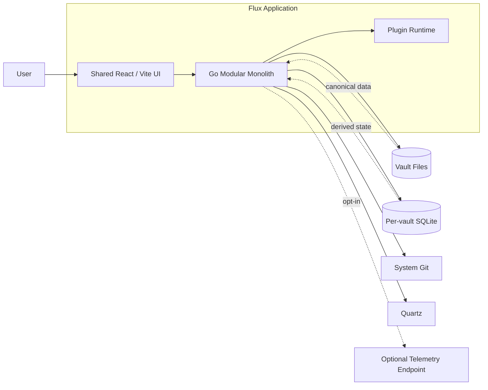

The vault is the source of truth. SQLite, plugin caches, and previews are rebuildable.

---

## 5. Monorepo Layout

```text
flux/
├── apps/
│   ├── desktop/                 # Electron application
│   ├── web/                     # Web entrypoint
│   └── server/                  # Go server entrypoint
├── packages/
│   ├── ui/                      # Shared React/Vite UI
│   ├── editor/                  # CodeMirror integration
│   ├── contracts/               # Shared API and event contracts
│   ├── client-desktop/          # Electron IPC adapter
│   ├── client-web/              # HTTP/WebSocket adapter
│   ├── plugin-sdk/              # Public TypeScript plugin SDK
│   └── design-system/           # shadcn/Tailwind components
├── internal/
│   └── backend/                 # Go modular monolith
├── plugins/
│   ├── kanban/                  # Official Kanban plugin
│   ├── git/                     # Optional Git integration
│   └── quartz/                  # Quartz integration
├── deployments/
│   ├── docker/
│   └── compose/
└── docs/
```

Turborepo manages JavaScript and TypeScript packages. Go modules remain independently buildable while sharing the repository.

---

## 6. Runtime Architecture

### 6.1 Shared Frontend Contract

The desktop and web applications use the same frontend packages and application state model.

```ts
interface FluxClient {
  openVault(request: OpenVaultRequest): Promise<VaultInfo>;
  readFile(path: string): Promise<FileDocument>;
  saveFile(request: SaveFileRequest): Promise<SaveResult>;
  search(request: SearchRequest): Promise<SearchResult[]>;
  subscribeVaultEvents(vaultId: string): Unsubscribe;
}
```

Implementations:

- `DesktopFluxClient`: Electron IPC.
- `WebFluxClient`: HTTP commands/queries plus WebSocket events.

Transport code must stay outside feature modules.

### 6.2 Desktop Deployment

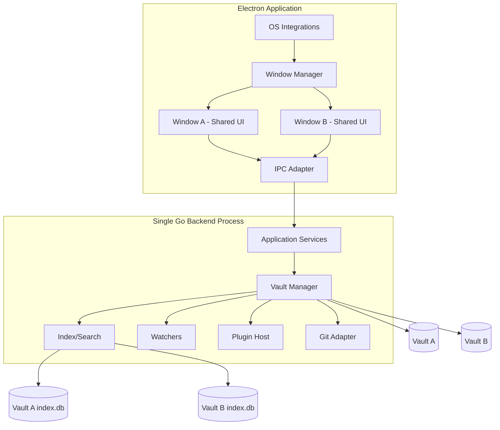

There is one Go process per desktop app session, not one process per window.

### 6.3 Web and Self-Hosted Deployment

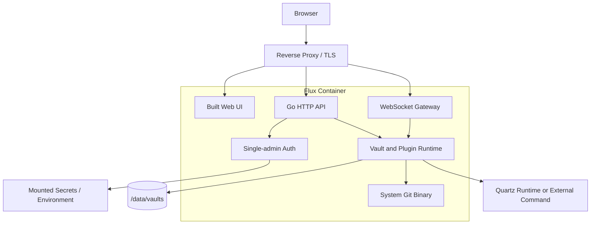

Initial packaging is one container with:

- Go server.
- Built frontend.
- Git binary.
- Plugin runtime.
- Persistent storage mounted at `/data/vaults`.

The server must never allow path traversal outside configured storage roots.

### 6.4 Authentication

Desktop mode has no application-level authentication.

Self-hosted web v1 uses:

- One administrator account.
- Password authentication.
- Secure server-side sessions.
- HTTP-only secure cookies.
- CSRF protection.
- Login rate limiting.
- Modern password hashing.

Multi-user identity and OAuth login are deferred.

---

## 7. Backend Module Boundaries

```text
internal/backend/
├── app/                         # Use cases and orchestration
├── vault/                       # Vault lifecycle and contexts
├── files/                       # File operations
├── documents/                   # Markdown/text parsing
├── index/                       # SQLite and FTS
├── search/                      # Query service
├── watcher/                     # Filesystem watcher
├── git/                         # Structured Git adapter
├── plugins/                     # Plugin registry and runtime
├── tasks/                       # Generic task indexing
├── recovery/                    # Crash recovery
├── auth/                        # Web authentication
├── transport/
│   ├── ipc/
│   ├── http/
│   └── websocket/
└── telemetry/
```

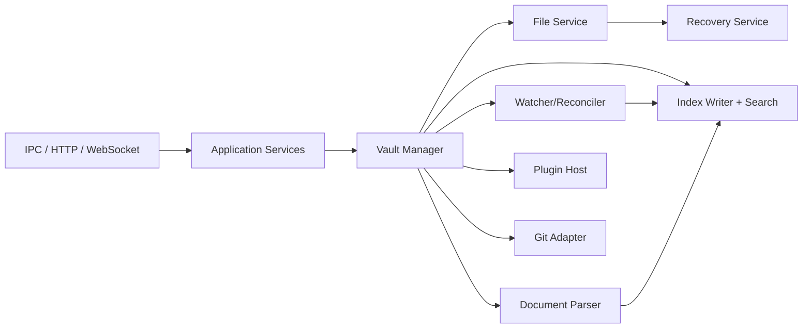

Modules communicate through interfaces and domain events, not through transport-specific dependencies.

---

## 8. Vault Model

### 8.1 Vault Definition

A vault is one user-selected root directory.

Flux supports opening:

- Existing Obsidian vaults.
- Existing Git repositories.
- Empty folders.
- General notes directories.

Nested vault semantics are not supported in v1.

### 8.2 Vault Directory Structure

```text
vault/
├── notes/
├── attachments/
├── archive/
├── .obsidian/                   # External app metadata
├── .git/                        # Optional Git repository
└── .flux/
    ├── vault.json
    ├── config.json                # Durable per-vault Flux feature settings
    ├── index.db
    ├── recovery/
    ├── trash/
    ├── plugins/
    └── cache/
```

`.flux/` is hidden from application navigation and always Git-ignored.

### 8.3 Vault Identity

`.flux/vault.json`:

```json
{
  "vault_id": "0190df4e-4965-7ee0-b5cf-a37ef18f1710",
  "vault_format_version": 1
}
```

Use UUIDv7.

A small global app database maps:

```text
vault_id -> last_known_path
```

Moving a vault preserves identity. Copying a vault may produce duplicate IDs; Flux detects this and defaults to assigning the copy a new ID.

### 8.4 Archive

Archive is durable content outside `.flux/`.

Archived files:

- Remain searchable.
- Remain linkable.
- Are hidden from normal navigation unless enabled.
- Are excluded from publishing by default.

### 8.5 Trash

Trash lives under `.flux/trash/`.

Trash is excluded from:

- Search.
- Backlinks.
- Graph.
- Publishing.
- Normal navigation.

Retention options:

- 7 days.
- 30 days, default.
- 90 days.
- Never automatically delete.

Show trash size and require confirmation for permanent deletion.

---

## 9. Vault Lifecycle

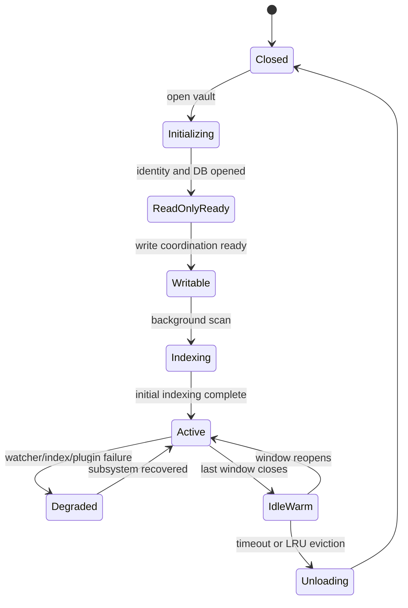

### 9.1 Opening Sequence

1. Validate the root path.
2. Load or create `.flux/vault.json`.
3. Open immediately in initialization/read-only mode.
4. Create or open `.flux/index.db`.
5. Initialize write coordination.
6. Start the filesystem watcher.
7. Run lightweight reconciliation.
8. Enable editing.
9. Continue full scan and indexing in the background.
10. Report progress to the UI.

Search may return partial results while indexing is incomplete.

### 9.2 Vault Context

Each open vault has one `VaultContext`.

```text
VaultContext
├── vault identity
├── root path
├── lifecycle state
├── watcher
├── SQLite pool
├── prioritized writer queue
├── file lock manager
├── document sessions
├── event bus
├── plugin host
├── Git repository adapter
└── indexing/reconciliation state
```

Multiple windows subscribe to the same context.

Window-specific UI state remains in app-level storage, not in durable vault files.

### 9.3 Idle Vaults

When the final window closes:

- Keep the context warm for roughly 30–60 seconds.
- Keep at most 2–3 idle contexts.
- Evict least recently used contexts.
- Flush queued writes.
- Stop watcher and plugin workers.
- Close SQLite connections.

---

## 10. Paths and Cross-Platform Rules

Internally store vault-relative paths with `/`.

At OS boundaries, use Go `filepath` conversion.

Rules:

- Preserve original filename casing.
- Windows and common macOS volumes are treated case-insensitively.
- Linux is treated case-sensitively.
- Detect collisions according to host filesystem rules.
- Handle case-only rename using an intermediate temporary name.
- Normalize Unicode for lookup while preserving original names.
- Never globally lowercase paths.
- Reject absolute paths and traversal sequences in vault operations.

---

## 11. Filesystem and File Operations

### 11.1 Centralized Operation Service

All create, write, rename, move, delete, restore, and attachment operations go through one file service.

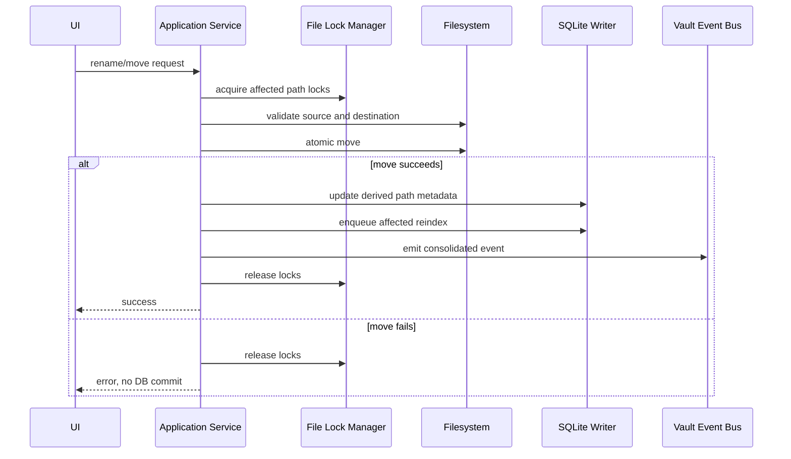

Rename/move behavior:

- Validate destination.
- Prevent traversal and root escape.
- Use atomic filesystem move where supported.
- Update links only when they were previously resolved to the moved file.
- Never perform blind vault-wide text replacement.
- Preserve ambiguous/unresolved links.
- Reindex the moved file and affected backlinks.
- Emit one consolidated event.

### 11.2 Atomic Writes

File writes use:

1. Per-file lock.
2. Expected hash verification.
3. Temporary file in the destination directory.
4. Write and flush.
5. Optional `fsync` according to durability policy.
6. Atomic rename/replace.
7. Release file lock.
8. Short SQLite metadata/FTS transaction.
9. Emit events.

Disk may briefly be ahead of SQLite. Reconciliation repairs this.

### 11.3 Lock Ordering

Required lock order:

```text
vault lifecycle lock
    -> file lock
        -> SQLite transaction
```

Never reverse the order.

Never call plugins, Git, UI callbacks, or watcher handlers inside a SQLite transaction.

No lock may wait forever. Save failures retain the editor buffer and surface an error.

---

## 12. Editor, Autosave, and Concurrency

### 12.1 Autosave

- Debounce saves by 500–1000 ms.
- Force save on:
  - Tab switch.
  - Window blur.
  - Vault switch.
  - Application shutdown.
- Watcher events are not the autosave mechanism.

### 12.2 Shared Document Sessions

When multiple Flux windows open the same file, they share one in-memory document session through the vault context.

This prevents same-application windows from creating avoidable conflicts.

### 12.3 External Change Detection

Each document session tracks:

- Base disk hash.
- Current in-memory content.
- Dirty state.
- Last successful persisted hash.

On save, compare the expected base hash to the current disk hash.

### 12.4 Conflict Flow

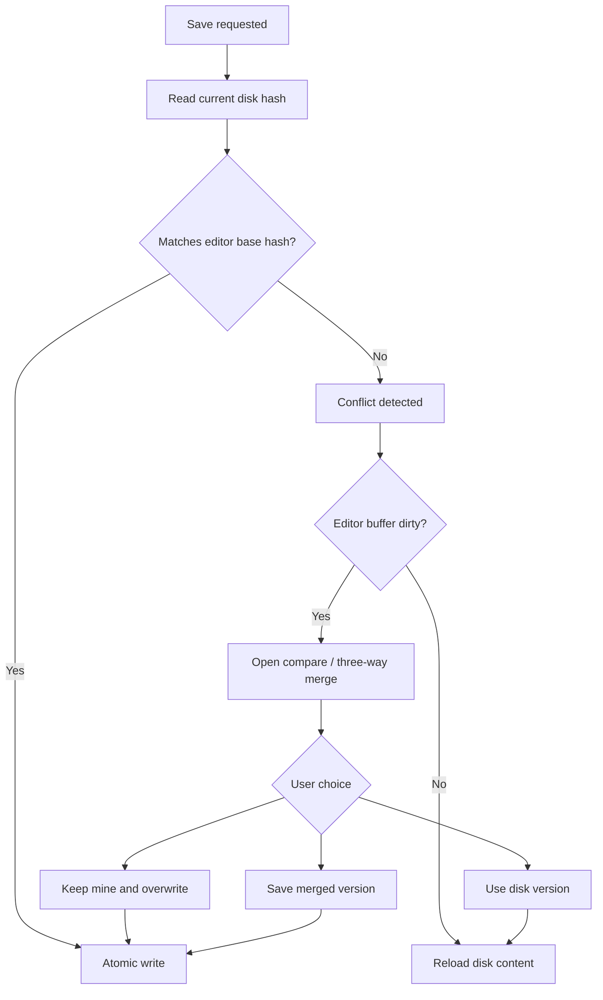

Support:

- Keep mine.
- Use disk.
- Side-by-side comparison.
- Automatic three-way merge where possible.
- Manual merge editor.

Large base snapshots may spill to `.flux/recovery/`.

---

## 13. Crash Recovery

Recovery snapshots exist only for unsaved or failed writes.

Location:

```text
.flux/recovery/
```

Rules:

- Write snapshots for dirty buffers periodically and before risky lifecycle events.
- Delete a snapshot after successful persistence.
- Restore only when the snapshot is newer than disk.
- Present recovery choices explicitly.
- Recovery is separate from Git history.
- Recovery files are excluded from search, plugins, publishing, and Git.

---

## 14. File Watching and Reconciliation

Use one recursive watcher per open vault plus periodic reconciliation.

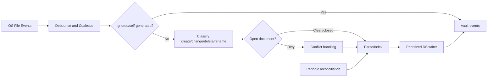

Rules:

- Debounce duplicate path events.
- Coalesce create/delete bursts into probable renames.
- Ignore `.flux`, `.git`, temporary files, swap files, and configured exclusions.
- Suppress self-generated events using expected path plus content hash.
- Do not rely on timestamps alone.
- Hash only when metadata indicates possible change.
- Use native file identity where available.
- Otherwise infer rename from hash, size, timing, and path proximity.
- On watcher overflow, reconnect, or failure, run a scoped rescan.
- Run a lightweight full reconciliation at vault open and periodically.
- Watcher failure degrades freshness but must not block editing.

---

## 15. Indexing and Search

### 15.1 Database Strategy

Use:

- One SQLite database per vault at `.flux/index.db`.
- One small global database in OS app-data for recent vaults, window state, settings, and global plugin installation metadata.

Per-vault databases improve isolation and rebuildability.

SQLite configuration:

- WAL mode.
- Busy timeout around 3000 ms.
- Separate read connections.
- One serialized writer goroutine per vault.
- Foreign keys enabled.
- Frequent short transactions.

### 15.2 Prioritized Writer Queue

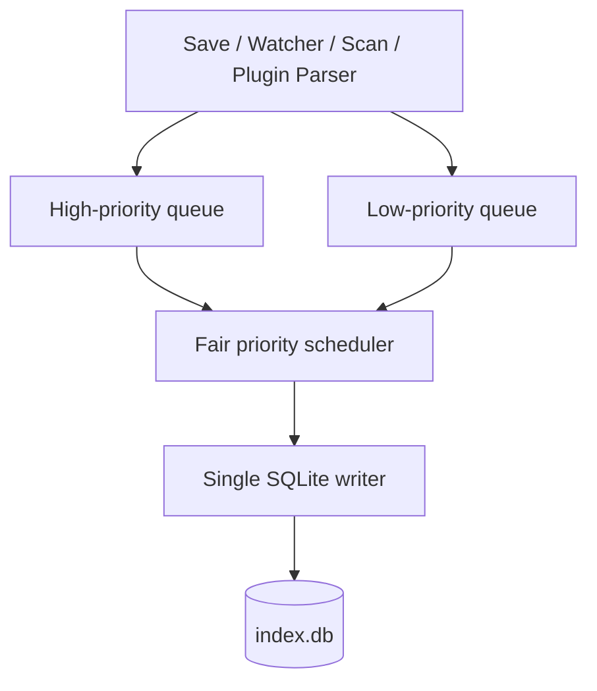

High priority:

- Active file saves.
- Rename/delete.
- External changes to open files.

Low priority:

- Initial scan.
- Background reindex.
- Cleanup.
- Thumbnail metadata updates.

Drain high priority first without starving low priority.

### 15.3 Indexing Policy

Markdown:

- Full text.
- Headings.
- Tags.
- Links.
- Backlinks.
- Frontmatter.
- Aliases.
- Tasks.
- Graph metadata.

Other text files:

- Filename.
- Full text.
- Basic metadata.

Binary files:

- Filename.
- MIME type.
- Size.
- timestamps.
- Hash.
- Plugin-extracted text, if available.

Defaults:

- Full-text index files up to approximately 5 MB.
- Warn before previewing roughly 20–50 MB files.
- Stream large files.
- Ignore heavy directories such as `node_modules`, `.git`, `dist`, and `build`.
- Allow per-vault limit overrides.

### 15.4 Index Consistency

Store:

- `content_hash`: latest known disk content.
- `indexed_hash`: content represented in the derived index.

If they differ, enqueue reindexing.

A file write may succeed while DB update fails. Startup and watcher reconciliation must repair the index.

---

## 16. SQLite Schema

SQLite integer primary keys are sufficient because IDs are internal to one disposable per-vault database.

### 16.1 Files

```sql
CREATE TABLE files (
    id              INTEGER PRIMARY KEY,
    relative_path   TEXT NOT NULL UNIQUE,
    display_name    TEXT NOT NULL,
    extension       TEXT,
    kind            TEXT NOT NULL,
    mime_type       TEXT,
    size_bytes      INTEGER NOT NULL,
    modified_at     INTEGER NOT NULL,
    created_at      INTEGER,
    content_hash    TEXT,
    indexed_hash    TEXT,
    is_archived     INTEGER NOT NULL DEFAULT 0,
    is_hidden       INTEGER NOT NULL DEFAULT 0,
    is_deleted      INTEGER NOT NULL DEFAULT 0
);
```

### 16.2 Full-Text Search

```sql
CREATE VIRTUAL TABLE content_fts USING fts5(
    file_id UNINDEXED,
    relative_path,
    title,
    body,
    tokenize = 'unicode61'
);
```

Do not duplicate full file bodies in ordinary tables.

### 16.3 Markdown Documents

```sql
CREATE TABLE markdown_documents (
    file_id             INTEGER PRIMARY KEY,
    title               TEXT,
    frontmatter_json    TEXT,
    parse_version       INTEGER NOT NULL,
    parsed_at           INTEGER NOT NULL,
    FOREIGN KEY(file_id) REFERENCES files(id) ON DELETE CASCADE
);
```

Original frontmatter remains in the Markdown file. Parsed JSON is derived and queryable.

YAML frontmatter is the supported v1 format.

### 16.4 Headings

```sql
CREATE TABLE headings (
    id                  INTEGER PRIMARY KEY,
    file_id             INTEGER NOT NULL,
    level               INTEGER NOT NULL,
    text                TEXT NOT NULL,
    base_anchor         TEXT NOT NULL,
    resolved_anchor     TEXT NOT NULL,
    position            INTEGER NOT NULL,
    FOREIGN KEY(file_id) REFERENCES files(id) ON DELETE CASCADE,
    UNIQUE(file_id, resolved_anchor)
);
```

Duplicate anchors receive deterministic suffixes:

```text
section
section-1
section-2
```

Recompute anchors in document order.

### 16.5 Links and Backlinks

```sql
CREATE TABLE links (
    id                  INTEGER PRIMARY KEY,
    source_file_id      INTEGER NOT NULL,
    raw_target          TEXT NOT NULL,
    target_file_id      INTEGER,
    heading_anchor      TEXT,
    link_type           TEXT NOT NULL,
    position            INTEGER,
    FOREIGN KEY(source_file_id) REFERENCES files(id) ON DELETE CASCADE,
    FOREIGN KEY(target_file_id) REFERENCES files(id) ON DELETE SET NULL
);
```

Supported link types include:

- Wiki link.
- Markdown link.
- Heading link.
- Embed.
- Image.
- Attachment.
- External URL.

Resolution priority:

1. Exact vault-relative path.
2. Path relative to the current note.
3. Exact unique filename.
4. Exact unique alias.
5. Otherwise unresolved or ambiguous.

Never silently choose among duplicates.

### 16.6 Aliases

```sql
CREATE TABLE aliases (
    id                  INTEGER PRIMARY KEY,
    file_id             INTEGER NOT NULL,
    display_alias       TEXT NOT NULL,
    normalized_alias    TEXT NOT NULL,
    FOREIGN KEY(file_id) REFERENCES files(id) ON DELETE CASCADE
);

CREATE INDEX aliases_normalized_idx
ON aliases(normalized_alias);
```

Duplicate aliases are allowed. Multiple matches are treated as ambiguous.

### 16.7 Tags

```sql
CREATE TABLE tags (
    id                  INTEGER PRIMARY KEY,
    display_name        TEXT NOT NULL,
    normalized_path     TEXT NOT NULL UNIQUE
);

CREATE TABLE file_tags (
    file_id             INTEGER NOT NULL,
    tag_id              INTEGER NOT NULL,
    source              TEXT NOT NULL,
    PRIMARY KEY(file_id, tag_id, source),
    FOREIGN KEY(file_id) REFERENCES files(id) ON DELETE CASCADE,
    FOREIGN KEY(tag_id) REFERENCES tags(id) ON DELETE CASCADE
);
```

Hierarchical tags use one normalized path string:

```text
movies/sci-fi/dystopian
```

Parent filtering uses exact match plus descendant prefix. The UI may display a tree without requiring recursive relational storage.

### 16.8 Tasks

```sql
CREATE TABLE tasks (
    id                  INTEGER PRIMARY KEY,
    file_id             INTEGER NOT NULL,
    block_id            TEXT,
    line_number         INTEGER,
    text                TEXT NOT NULL,
    checked             INTEGER NOT NULL,
    status              TEXT,
    priority            TEXT,
    due_date            TEXT,
    completed_at        TEXT,
    position            INTEGER NOT NULL,
    FOREIGN KEY(file_id) REFERENCES files(id) ON DELETE CASCADE
);

CREATE UNIQUE INDEX tasks_file_block_idx
ON tasks(file_id, block_id)
WHERE block_id IS NOT NULL;
```

The table is derived. Markdown remains canonical.

### 16.9 Tombstones

```sql
CREATE TABLE file_tombstones (
    id                  INTEGER PRIMARY KEY,
    old_relative_path   TEXT NOT NULL,
    old_file_id         INTEGER,
    content_hash        TEXT,
    deleted_at          INTEGER NOT NULL
);
```

Tombstones are temporary and assist rename/delete reconciliation.

### 16.10 Index Jobs

```sql
CREATE TABLE index_jobs (
    id                  INTEGER PRIMARY KEY,
    job_type            TEXT NOT NULL,
    status              TEXT NOT NULL,
    total_items         INTEGER,
    processed_items     INTEGER NOT NULL DEFAULT 0,
    error_message       TEXT,
    started_at          INTEGER,
    finished_at         INTEGER
);
```

---

## 17. Search Architecture

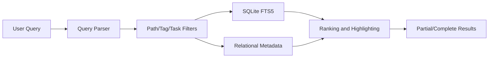

Search must:

- Return partial results during indexing.
- Expose indexing progress.
- Support path, file type, tag, task state, archive, and link filters.
- Exclude trash and hidden internal directories.
- Avoid loading complete large files merely to display results.

---

## 18. Markdown and Compatibility

Rules:

- Preserve unknown syntax.
- Preserve unknown frontmatter keys.
- Do not normalize or rewrite a file unless the user edits it or invokes a feature.
- Keep `.obsidian/` hidden in normal navigation.
- Read `.obsidian/` only for explicitly supported compatibility behavior.
- Keep app-specific runtime state under `.flux/`.
- Do not implement an import/export workflow; a vault is already portable.

---

## 19. Tasks and Official Kanban Plugin

### 19.1 Core Task Model

Core indexes every Markdown checkbox:

```md
- [ ] Prepare roadmap
- [x] Approve release notes
```

All checkboxes may appear as work items after the Kanban plugin is installed.

### 19.2 Stable Task Identity

Line numbers are unstable. When Kanban begins managing a task, assign a visible stable Markdown block ID:

```md
- [ ] Prepare roadmap ^task-a8f31c
```

Example task properties:

```md
- [ ] Prepare roadmap ^task-a8f31c
  status:: in-progress
  priority:: high
  due:: 2026-08-01
```

Do not hide Kanban metadata inside CodeMirror. Source mode must show the actual file.

### 19.3 Kanban Data Flow

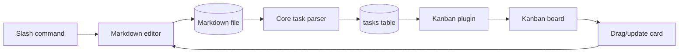

The plugin may derive:

- Board.
- Column/status.
- Priority.
- Due date.
- Assignee.
- Project.
- Ordering.

The plugin must write changes back to Markdown. It must not create a separate canonical card database.

Board filtering may use:

- Folder.
- Tag.
- Frontmatter.
- Task status.
- Saved view configuration.

All tasks may appear by default, but users can narrow boards with filters.

---

## 20. Attachments and Binary Files

Attachments are ordinary vault files, not blobs in SQLite.

Use the `files` table for metadata and `links` for references.

Rules:

- Store binaries inside the vault.
- Default paste/drop folder is configurable, such as `attachments/`.
- Use collision-safe names.
- Detect MIME type from bytes, not extension alone.
- Stream large files.
- Generate previews and thumbnails only in `.flux/cache/`.
- Missing attachments remain unresolved links.
- Plugins may extract searchable text.
- Original binary remains canonical.
- Renames use the centralized file operation service.
- Web uploads use temporary files, size limits, path sanitization, and atomic move.

---

## 21. Plugin Architecture

### 21.1 Distribution

Plugins are external TypeScript/JavaScript bundles.

A trusted marketplace registry contains:

- Plugin ID.
- Manifest.
- Version.
- Checksum.
- Download URL.
- Publisher.
- Required permissions.
- Optional permissions.
- Changelog.

Registry is a separate metadata repository. Plugin source and release artifacts stay in
publisher repositories. Generated `registry.json` snapshots bounded publisher README
content and release metadata; detached Ed25519 signature covers exact index bytes.
Flux verifies registry signature, package checksum, and packaged manifest before staging.
Landing page reads same public index. See `docs/plugin-marketplace.md`.

Plugins are installed globally once:

```text
app-data/plugins/<plugin-id>/<version>/
```

Per-vault plugin state:

```text
vault/.flux/plugins/<plugin-id>/state/
```

Disposable cache:

```text
vault/.flux/cache/plugins/<plugin-id>/
```

### 21.2 Capability Model

Plugins never receive direct access to:

- Raw Node.js APIs.
- Electron internals.
- Arbitrary filesystem paths.
- Shell execution.
- Internal Go objects.
- Unrestricted network.
- Other plugins' private state.

Instead they call capability APIs such as:

```text
vault.read
vault.write
vault.search
documents.parse
tasks.query
tasks.update
ui.command
ui.view
network.fetch
background.run
git.status
git.commit
```

New plugin needs should produce reusable generic capabilities, not plugin-specific backend hooks.

### 21.3 Permissions

Manifest permissions are explicit.

Installation flow:

1. Display plugin metadata.
2. Display required and optional permissions.
3. Obtain approval for the exact permission set.
4. Install staged package.
5. Verify checksum/signature.
6. Activate.

When an update expands permissions, require new approval.

Do not provide a global “never warn again” option.

### 21.4 Runtime Isolation

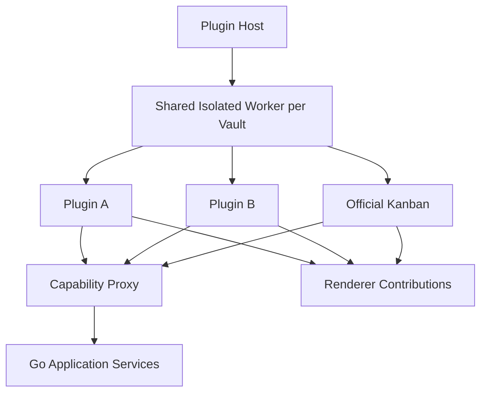

Use a shared isolated worker per vault rather than one OS process per plugin.

Failure behavior:

- Per-plugin error boundary.
- Repeatedly failing plugin auto-disables.
- Worker crash triggers one restart.
- Healthy plugins are restored.
- Plugin failures do not stop vault operation.

Event-driven activation is the default.

Continuous background execution requires `background.run`, intervals, quotas, and cancellation.

### 21.5 Updates and Rollback

- Stage new version beside the current version.
- Verify package.
- Test activation.
- Switch the active pointer only after success.
- Keep current and previous versions.
- Roll back automatically after failed activation.
- Apply via plugin restart, vault reload, or next app launch.
- Show changelog, package size, and permission changes.

### 21.6 Uninstall

- Remove installed binaries immediately if unused.
- Retain per-vault state for approximately 30 days by default.
- Show retained size.
- Offer “delete all state now.”
- Periodically prune orphaned state.

### 21.7 Plugin Settings

Manifest-declared settings render through shared desktop/web UI. Values are validated by
declared type and stored per vault at:

```text
.flux/plugins/<plugin-id>/state/settings.json
```

Plugin runtime receives an immutable settings snapshot at activation. Saving settings
restarts that vault's isolated plugin runtime so new values apply without granting direct
filesystem access.

---

## 22. Git and Version Control

Git is optional. Vaults work fully without Git.

### 22.1 Repository Model

- One Git repository per vault.
- Repository root must equal vault root.
- Nested repositories and submodules are unsupported in v1.
- Nested `.git` directories are ignored by Flux Git operations.
- Existing repositories are detected and adopted.
- Enabling version control runs `git init`.
- `.flux/` is always added to `.gitignore`.
- No automatic commit by default.

### 22.2 Enable VCS Flow

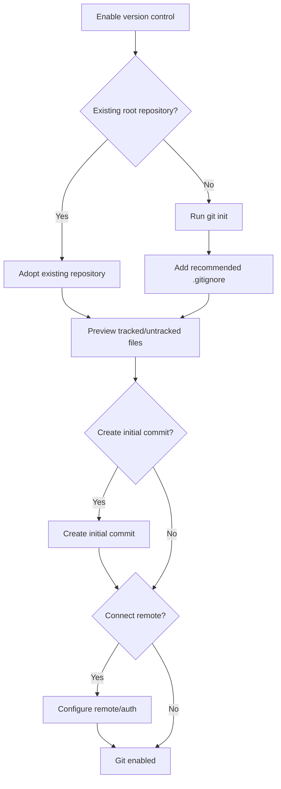

### 22.3 Git Adapter

Use the system-installed Git binary through a structured adapter.

Do not expose arbitrary shell commands.

Allowlisted operations include:

- Status.
- Diff.
- Log.
- Add/stage.
- Commit.
- Pull.
- Push.
- Fetch.
- Branch listing.
- Controlled checkout.
- Remote configuration.

All arguments are validated and passed directly to the Git process without shell interpolation.

### 22.4 Concurrency

- Serialize mutating Git operations per vault.
- Allow safe read-only status/log queries concurrently.
- Before pull, checkout, reset, or merge:
  - Detect dirty in-memory editor buffers.
  - Require save, discard, or cancellation.
- Never run destructive actions without explicit confirmation.
- Git failure never blocks ordinary editing.

### 22.5 State and Credentials

Repository state remains on disk.

SQLite may cache status for UI responsiveness, but the cache is non-authoritative.

Credentials:

- Desktop: OS credential manager/keychain.
- Self-hosted: mounted secrets, credential helper, or environment-backed configuration.
- Never store tokens in the vault or `.flux/`.

OAuth may be used to fetch tokens and create/manage repositories, but Git remains the transport mechanism.

### 22.6 Git Pipeline

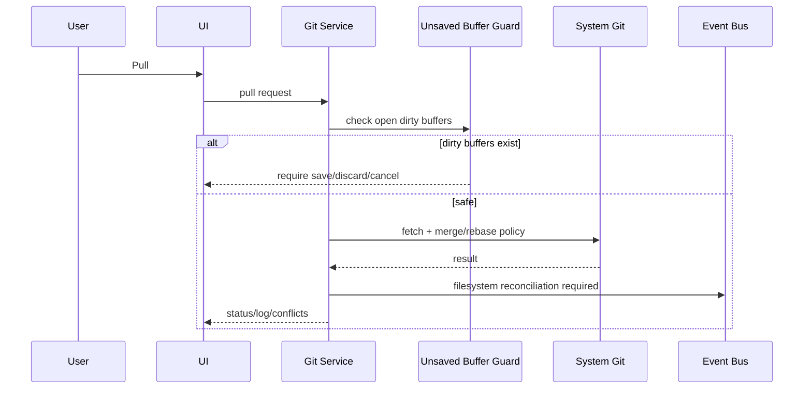

Crash recovery is separate from Git history.

---

## 23. Quartz Integration

Flux does not reproduce Quartz functionality.

The integration boundary may:

- Select vault paths.
- Write Quartz-compatible frontmatter when explicitly requested.
- Trigger controlled Quartz build/publish commands.
- Show logs and errors.

Quartz owns:

- Routing.
- Site generation.
- Themes.
- Backlink rendering.
- Publish inclusion rules.
- Deployment behavior.

The adapter must not receive arbitrary shell input.

---

## 24. Versioning and Migrations

Use independent version numbers:

```text
.flux/vault.json
    vault_format_version

SQLite PRAGMA user_version
    index_schema_version
```

Rules:

- `vault_format_version` changes only when durable `.flux` structure changes.
- `index_schema_version` changes for SQLite schema changes.
- Run migrations before enabling writes.
- Back up `index.db` before destructive migrations.
- If migration fails, keep user files accessible.
- Prefer rebuilding derived SQLite state over complex recovery.
- Never rewrite user Markdown automatically without explicit feature need and approval.
- Support at least one previous vault format.
- Open unsupported newer formats read-only with a clear error.

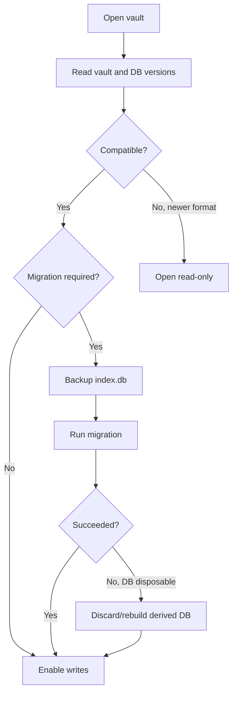

---

## 25. Security Model

### 25.1 Filesystem Security

- Restrict all operations to the active vault root.
- Resolve and validate paths before access.
- Reject path traversal.
- Handle symlinks according to configured policy.
- Default server behavior should reject symlink escapes.
- Validate archive extraction and uploads.
- Use random temporary filenames.
- Apply size and resource limits.

### 25.2 Plugin Security

- Capability-based permissions.
- Verified package checksum/signature.
- No unrestricted shell.
- No unrestricted filesystem.
- Network permission separated from vault permission.
- Background execution permission separated.
- Per-plugin quotas and cancellation.
- Audit important high-risk capability calls.

### 25.3 Git Security

- Structured command execution.
- No shell interpolation.
- Vault-root working directory only.
- Redact credentials from logs.
- Disable unsupported hooks or warn before executing repository hooks.
- Do not automatically trust repository configuration from untrusted vaults.

### 25.4 Web Security

- TLS through reverse proxy.
- Secure cookies.
- CSRF protection.
- Login rate limiting.
- Content Security Policy.
- Strict upload limits.
- No direct filesystem browsing outside configured roots.
- Sanitize rendered HTML and Markdown.
- Treat plugin UI as untrusted.

---

## 26. Reliability and Degraded Modes

Flux should remain usable when optional subsystems fail.

| Failure | Required Behavior |
|---|---|
| SQLite unavailable/corrupt | Files remain accessible; rebuild index |
| Watcher failure | Editing continues; show degraded state; poll/rescan |
| Plugin crash | Disable plugin; core continues |
| Git failure | Editing continues; show Git error |
| Preview generation failure | Show generic file metadata |
| Quartz failure | Show logs; vault unaffected |
| Telemetry failure | Ignore and continue |
| Crash recovery write failure | Surface warning; normal save still attempted |

---

## 27. Telemetry

Telemetry is optional and disabled by default.

Separate:

1. Product analytics.
2. Crash diagnostics.
3. Local crash recovery.

Rules:

- Never send note bodies, filenames, vault paths, task text, frontmatter, Git diffs, tokens, or plugin state.
- Allow users to inspect what is collected.
- Direct telemetry to a user-configurable endpoint where appropriate.
- Self-hosted deployments can disable telemetry entirely.
- Telemetry failure is non-blocking.

---

## 28. Event Model

Representative vault events:

```text
vault.opened
vault.ready
vault.indexing.progress
vault.degraded
file.created
file.changed
file.moved
file.deleted
file.restored
document.conflict
index.updated
task.changed
plugin.enabled
plugin.disabled
git.status.changed
git.conflict
```

Events carry:

- Vault ID.
- Monotonic sequence number.
- Event type.
- Affected relative paths or internal IDs.
- Content/version hash where relevant.
- Timestamp.

Clients reconnecting after a WebSocket interruption should request a fresh snapshot if event sequence continuity was lost.

---

## 29. API Shape

Use command/query separation at the application boundary.

Representative commands:

```text
OpenVault
CloseVault
CreateFile
SaveFile
MoveFile
DeleteFile
RestoreFile
UpdateTask
EnablePlugin
DisablePlugin
EnableGit
GitCommit
GitPull
GitPush
```

Representative queries:

```text
GetVault
ListFiles
ReadFile
Search
GetBacklinks
GetGraph
GetTasks
GetPluginStatus
GetGitStatus
GetGitLog
```

Desktop IPC and web HTTP map to the same application commands.

---

## 30. End-to-End Save and Index Pipeline

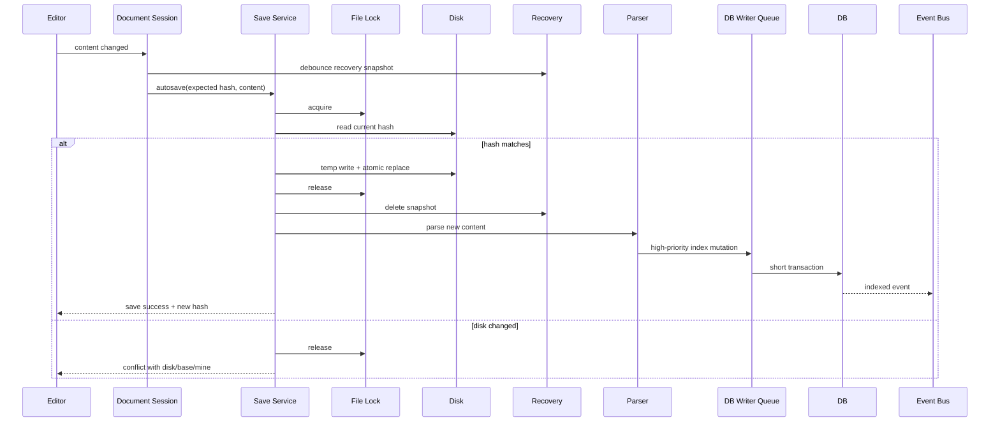

---

## 31. Initial Indexing Pipeline

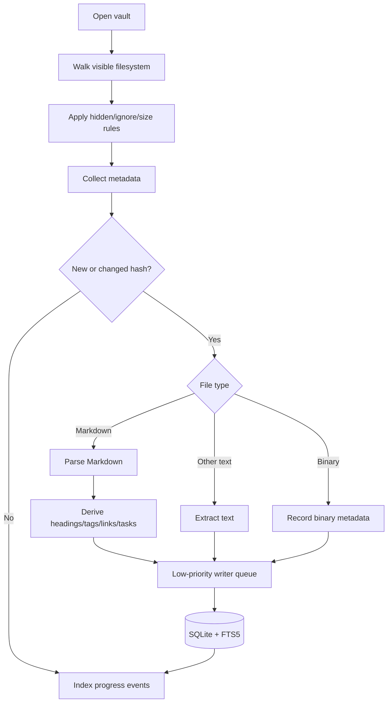

---

## 32. Deployment and Operations

### 32.1 Desktop

- Signed application packages.
- Auto-update may update Flux binaries, not vault content.
- Go backend binary shipped with Electron.
- System Git detected at runtime.
- OS keychain used for credentials.
- Per-user global app DB in OS app-data.

### 32.2 Self-Hosted

Recommended Compose topology:

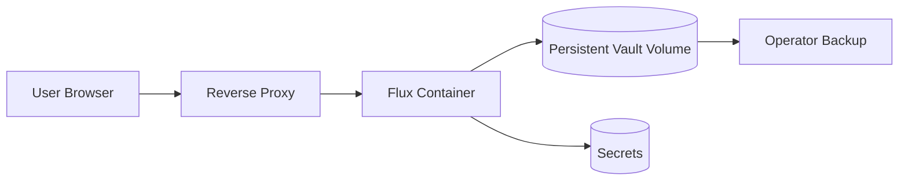

Operational requirements:

- Persistent volume for `/data/vaults`.
- Persistent app-data volume.
- Readiness endpoint.
- Liveness endpoint.
- Graceful shutdown that flushes writes.
- Structured logs.
- Resource limits.
- Backup documentation focused on vault files first.
- `.flux/index.db` may be omitted from backups if rebuild time is acceptable.
- `.flux/recovery/` should usually be backed up only for short-term operational recovery.

### 32.3 One-Click Hosting

A one-click deployment should provision:

- Flux container.
- Persistent storage.
- TLS-capable frontend or platform routing.
- Admin password secret.
- Optional Git credentials.
- Optional Quartz deployment.

---

## 33. Observability

Metrics:

- Open vault count.
- Active/idle vault contexts.
- Index queue depth by priority.
- Indexing rate.
- Search latency.
- Save latency.
- Watcher overflow count.
- Reconciliation count.
- SQLite busy/error count.
- Plugin crashes and auto-disables.
- Git operation duration/failure count.
- WebSocket reconnect count.

Logs must redact:

- File contents.
- Task text.
- Vault absolute paths where unnecessary.
- Credentials.
- Git remote tokens.
- Frontmatter values.
- Plugin private state.

Use correlation IDs for commands and background jobs.

---

## 34. Testing Strategy

### 34.1 Unit Tests

- Path normalization.
- Link resolution.
- Heading anchor generation.
- Tag normalization.
- Task parsing.
- Frontmatter preservation.
- Permission checks.
- Git argument construction.
- Migration logic.

### 34.2 Integration Tests

- Atomic save and DB lag recovery.
- External file edits.
- Rename inference.
- Multiple windows editing one file.
- Watcher overflow.
- SQLite corruption and rebuild.
- Plugin crash isolation.
- Git enablement on old Obsidian vault.
- Web upload traversal prevention.
- Case-only rename.
- Duplicate aliases and filenames.

### 34.3 Compatibility Fixtures

Maintain test vaults for:

- Plain Markdown.
- Existing Obsidian vault.
- Large vault.
- Duplicate filenames.
- Duplicate headings.
- Hierarchical tags.
- Broken links.
- Mixed Unicode filenames.
- Windows/macOS/Linux casing differences.
- Git and non-Git vaults.

### 34.4 Failure Injection

Inject failures at:

- Temporary file write.
- Atomic rename.
- SQLite transaction.
- Watcher startup.
- Plugin activation.
- Git process.
- WebSocket delivery.
- Migration.
- Recovery snapshot.

---

## 35. Performance Targets

Initial targets, to be validated with benchmarks:

- Vault UI becomes navigable before full indexing completes.
- Typical save acknowledgement under 100 ms after debounce, excluding slow storage.
- Search p95 under 200 ms for common local queries on medium vaults.
- High-priority DB mutations should not wait behind bulk indexing.
- Opening an already indexed medium vault should avoid full content rehash.
- Idle vault contexts must release watcher, DB, and plugin resources after eviction.
- Large files must be streamed and bounded by memory limits.

---

## 36. Architectural Decisions Summary

| Area | Decision |
|---|---|
| Backend | Go modular monolith |
| Frontend | Shared React/Vite UI |
| Desktop transport | Electron IPC |
| Web transport | HTTP + WebSocket |
| Canonical data | Vault filesystem |
| Derived index | One SQLite DB per vault |
| Full-text search | SQLite FTS5 |
| Desktop process model | One Go backend per app session |
| Vault runtime | One `VaultContext` per open vault |
| Writes | Atomic temp-write and rename |
| DB writes | One prioritized writer goroutine per vault |
| Conflicts | Hash-based optimistic concurrency + three-way merge |
| Watcher | Recursive watcher plus periodic reconciliation |
| Plugins | TypeScript/JavaScript, capability based |
| Plugin runtime | Shared isolated worker per vault |
| Tasks | All Markdown checkboxes indexed |
| Kanban | Official plugin, Markdown remains canonical |
| Task identity | Visible stable block ID |
| Attachments | Ordinary vault files |
| Version history | Optional system Git |
| Git repository | One root repository per vault |
| Publishing | Delegated to Quartz |
| Import/export | None; open vault directly |
| Web auth | Single-admin password/session |
| Cloud storage root | `/data/vaults` |
| Telemetry | Optional, off by default |
| Vault identity | UUIDv7 in `.flux/vault.json` |
| Migration policy | Rebuild disposable DB when safer |

---

## 37. AI Chat Plugin, BYOM, Tutor Mode, and MCP

### 37.1 One AI Chat Plugin

Flux has one official AI Chat plugin. Tutor Mode is a workflow inside that plugin, not a separately installed plugin.

The same AI Chat surface may provide:

- Tutor Mode.
- General vault assistance.
- Research and synthesis.
- Vault organization.
- Note generation.
- Flashcards and quizzes.
- Mind maps.
- Task and roadmap creation.
- Git-assisted workflows.

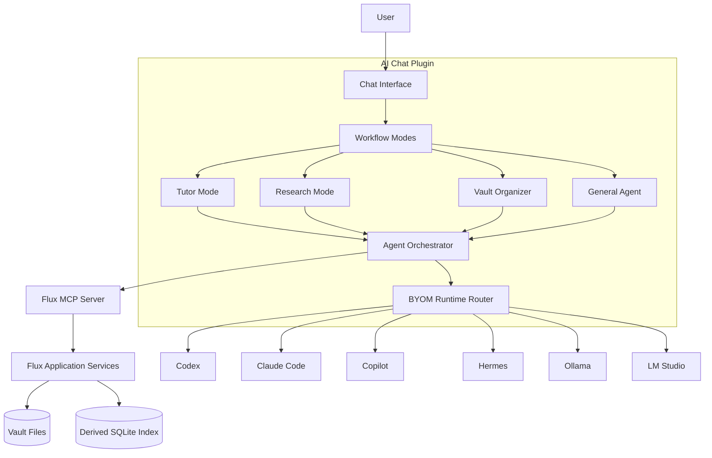

### 37.2 Unified MCP Manipulation Path

The internal AI Chat plugin uses the same Flux MCP server exposed to external AI applications. It must not write files, tasks, links, frontmatter, or Git state through a separate privileged path.

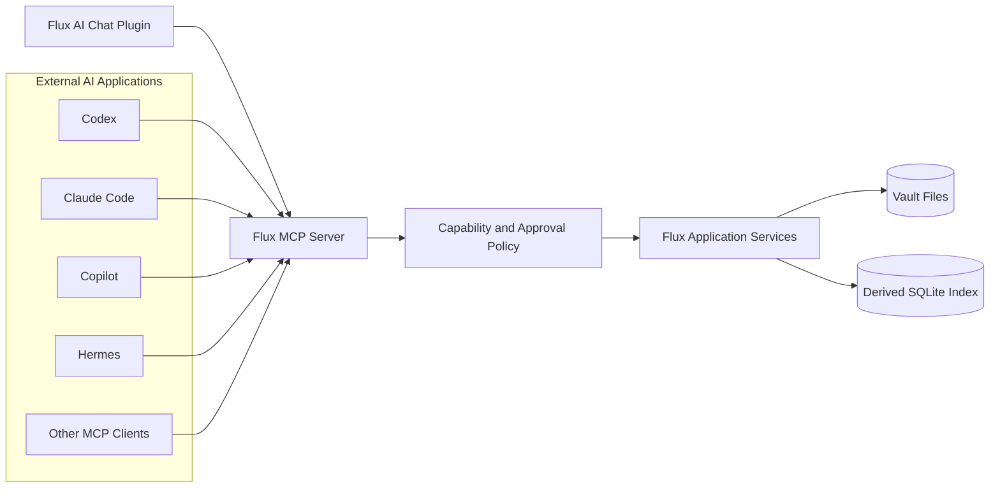

The invariant is:

```text
AI Chat workflow or external AI agent
    -> Flux MCP tools
    -> capability and approval policy
    -> Flux application services
    -> canonical vault files
    -> parser and indexer
    -> backlinks, tasks, search, and graph updated automatically
```

AI does not directly mutate a graph database. It changes canonical files through application services; the normal parser and indexer derive links, backlinks, tasks, search entries, and graph edges.

### 37.3 BYOM Runtime Architecture

The AI Chat plugin supports bring-your-own-model and bring-your-own-agent runtimes.

#### Direct model API runtimes

Flux manages the reasoning and tool-execution loop.

Examples:

- Ollama.
- LM Studio.
- OpenAI-compatible endpoints.
- Other local or hosted model APIs.

#### External agent runtimes

The provider manages its own reasoning, context management, approvals, and tool loop.

Examples:

- Codex.
- Claude Code.
- GitHub Copilot.
- Hermes.

```mermaid
flowchart TD
    Chat[AI Chat Request]
    Runtime{Runtime Type}

    Direct[Direct Model API]
    FluxLoop[Flux-managed Agent Loop]

    Agent[External Agent Runtime]
    ProviderLoop[Provider-managed Agent Loop]

    MCP[Flux MCP Server]
    Vault[(Vault)]

    Chat --> Runtime
    Runtime -- Ollama / LM Studio / API --> Direct --> FluxLoop --> MCP
    Runtime -- Codex / Claude / Copilot / Hermes --> Agent --> ProviderLoop --> MCP
    MCP --> Vault
```

Provider-specific behavior stays behind a common runtime abstraction.

```ts
interface AIRuntime {
  id: string;
  capabilities(): Promise<AIRuntimeCapabilities>;
  run(request: AgentRequest): AsyncIterable<AgentEvent>;
  cancel(requestId: string): Promise<void>;
}
```

Capabilities may include:

```text
chat
streaming
tool-calling
vision
PDF input
embeddings
structured output
reasoning controls
context caching
external-agent-loop
```

Flux detects capabilities rather than assuming every runtime supports every feature.

### 37.4 Shared MCP Tool Registry

The AI Chat plugin and external MCP clients share one tool registry.

Representative tools:

```text
flux_list_vaults
flux_get_vault
flux_get_vault_status

flux_list_files
flux_read_file
flux_create_directory
flux_create_file
flux_update_file
flux_move_file
flux_delete_file
flux_restore_file

flux_search
flux_get_backlinks
flux_get_outgoing_links
flux_get_broken_links
flux_resolve_link
flux_get_graph_neighbors
flux_create_link
flux_remove_link

flux_list_tasks
flux_create_task
flux_update_task
flux_complete_task
flux_move_task

flux_get_frontmatter
flux_update_frontmatter
flux_list_tags
flux_add_tag
flux_remove_tag

flux_git_status
flux_git_diff
flux_git_commit
flux_git_pull
flux_git_push
```

For reliable multi-file changes, Flux may expose:

```text
flux_apply_vault_plan
```

`flux_apply_vault_plan` validates the entire operation set before applying it through normal path validation, locking, atomic writes, conflict handling, indexing, and event emission.

Before its first canonical write, it persists a private write-ahead journal under
`.flux/recovery/vault-plans/`. Journal contains normalized paths, original content hashes
and content required for rollback, plus target hashes. A committed marker is flushed only
after every file write succeeds. On next vault open, an uncommitted plan rolls back only
files still matching recorded target hashes; unexpected external changes stop recovery and
degrade vault instead of overwriting user data. Committed journals are cleaned without
rollback.

### 37.5 Tutor Mode Workflow

Tutor Mode is a guided workflow inside AI Chat for students who upload study material and want Flux to transform it into a usable study vault.

Tutor Mode does not merely summarize PDFs. It:

1. Stores uploaded source files inside the vault.
2. Ingests the complete source content.
3. Identifies chapters, topics, concepts, and prerequisites.
4. Asks or infers how the user wants content organized.
5. Creates folders and structured Markdown notes.
6. Creates links and backlinks between generated notes.
7. Allows the normal Flux parser to update search and graph state.
8. Generates a roadmap based on the created notes.
9. Generates flashcards, quizzes, revision tasks, and mind maps.

```mermaid
flowchart TD
    Upload[Upload PDFs in AI Chat]
    Store[Store Source Files in Vault]
    Ingest[Ingest Complete Content]
    Analyze[Identify Chapters and Topics]
    Preference[Choose Organization Style]
    Plan[Create Vault Mutation Plan]
    MCP[Execute Through Flux MCP]
    Notes[Create Folders and Notes]
    Links[Create Links and Backlinks]
    Index[Update Search and Graph]
    Roadmap[Generate Study Roadmap]
    Cards[Generate Flashcards]
    Quiz[Generate Quizzes]
    MindMap[Generate Mind Map]

    Upload --> Store --> Ingest --> Analyze --> Preference --> Plan --> MCP
    MCP --> Notes --> Links --> Index
    Index --> Roadmap
    Index --> Cards
    Index --> Quiz
    Index --> MindMap
```

Example generated structure:

```text
Operating Systems/
├── Sources/
│   ├── Lecture Notes.pdf
│   └── Textbook Chapter.pdf
├── 01-Processes/
│   ├── Overview.md
│   ├── Process States.md
│   └── Threads.md
├── 02-Scheduling/
│   ├── Scheduling Concepts.md
│   └── Scheduling Algorithms.md
├── 03-Memory/
│   ├── Paging.md
│   └── Virtual Memory.md
├── Study Roadmap.md
├── Flashcards.md
├── Practice Questions.md
└── Mind Map.md
```

Organization options may include chapter, topic, subject, exam unit, source document, or a user-defined hierarchy.

### 37.6 Full-Content Ingestion and Coverage

Tutor Mode must account for the complete uploaded source set before finalizing generated notes and the roadmap.

Models may process content incrementally because of context limits, but the orchestration layer tracks source coverage.

```mermaid
flowchart TD
    Sources[Uploaded Sources]
    Extract[Page-aware Extraction]
    Chunks[Source-preserving Chunks]
    Coverage[Coverage Tracker]
    Analyze[Topic and Concept Analysis]
    Draft[Draft Notes]
    Verify[Coverage and Citation Verification]
    Finalize[Finalize Vault Plan]

    Sources --> Extract --> Chunks
    Chunks --> Coverage
    Chunks --> Analyze --> Draft
    Coverage --> Verify
    Draft --> Verify --> Finalize
```

Before finalization, the orchestrator verifies:

- Every source file was processed.
- Every page or extractable section was accounted for.
- Major concepts were mapped to generated notes.
- Generated notes retain source provenance.
- Content omitted as irrelevant is explicitly tracked.
- Extraction failures are surfaced to the user.

Full-content ingestion does not require sending the complete document to a model in one prompt.

### 37.7 PDF and Source Processing

Production-grade processing:

1. Store the original document in the vault.
2. Compute its content hash.
3. Detect embedded text.
4. Extract text with page boundaries.
5. Use OCR only when embedded text is unavailable or unusable.
6. Detect chapters, headings, tables, and sections where possible.
7. Create source-aware chunks.
8. Cache extraction and embeddings under `.flux/`.
9. Reprocess only when source hash or parser version changes.

```mermaid
flowchart TD
    PDF[PDF File]
    Hash[Compute Hash]
    Cached{Matching Extraction Exists?}
    Text{Embedded Text Available?}
    Extract[Page-aware Extraction]
    OCR[OCR Fallback]
    Structure[Detect Layout and Sections]
    Chunks[Create Citation-preserving Chunks]
    Embed[Optional Embeddings]
    Store[Derived AI Index]

    PDF --> Hash --> Cached
    Cached -- Yes --> Store
    Cached -- No --> Text
    Text -- Yes --> Extract
    Text -- No --> OCR
    Extract --> Structure
    OCR --> Structure
    Structure --> Chunks --> Embed --> Store
```

Original source files remain canonical. Extracted text, chunks, embeddings, coverage maps, and model caches are disposable derived state.

### 37.8 Generated Notes and Provenance

Generated durable output is ordinary Markdown.

```md
---
type: generated-study-note
sources:
  - "[[Sources/Lecture Notes.pdf#page=18]]"
  - "[[Sources/Textbook Chapter.pdf#page=42]]"
---

# Virtual Memory

Virtual memory provides each process with a logical address space that is
mapped to physical memory and secondary storage.

## Related concepts

- [[Paging]]
- [[Page Replacement]]
- [[Demand Paging]]
```

AI-generated content should distinguish:

- Directly source-supported material.
- General model knowledge.
- Model inference.

Source-grounded behavior is the default in Tutor Mode.

### 37.9 Roadmaps, Flashcards, Quizzes, and Mind Maps

The roadmap is created after the note structure exists so it can link to actual generated notes.

```md
# Study Roadmap

- [ ] Read [[01-Processes/Overview]] ^task-processes
  effort:: 25m
  priority:: high

- [ ] Review [[01-Processes/Threads]] ^task-threads
  effort:: 20m
  priority:: high
  prerequisite:: [[01-Processes/Overview]]

- [ ] Study [[02-Scheduling/Scheduling Algorithms]] ^task-scheduling
  effort:: 45m
  priority:: high
```

Roadmap generation may consider exam date, available study time, source size, prerequisites, estimated difficulty, source emphasis, user confidence, quiz performance, and completed tasks. Effort estimates are estimates, not guarantees.

Flashcards and quizzes are ordinary Markdown. Operational spaced-repetition state may remain under:

```text
.flux/plugins/ai-chat/state/
```

Mind maps are derived from links between generated concept notes. Possible renderings include Mermaid, a filtered Flux graph, a canvas-style AI Chat view, or an exported image. Canonical relationships remain in note links.

### 37.10 MCP Security and Approval Modes

MCP connections receive scoped capabilities such as:

```text
vault.read
vault.write
vault.delete
vault.move
tasks.write
metadata.write
links.write
plugins.invoke
git.read
git.write
ai.generate
```

Recommended policies:

- **Read-only:** inspect and search selected vaults.
- **Guided write:** proposed writes require user approval.
- **Trusted workspace:** approved operations may run automatically within selected vaults.

Even trusted clients remain constrained by selected vault IDs, allowed tools, vault-root path boundaries, rate limits, file-size limits, and destructive-operation policy.

Example:

```text
create/update: allow
move: allow
delete: confirm
permanent delete: deny
git reset: deny
```

### 37.11 AI Chat and MCP Invariants

1. Flux has one AI Chat plugin; Tutor Mode is a workflow inside it.
2. Internal AI Chat and external agents use the same Flux MCP server.
3. AI-generated writes use the same application services as human edits.
4. MCP clients never bypass locking, atomic writes, or conflict handling.
5. Graph changes occur through canonical file changes.
6. Tutor Mode creates actual vault folders and notes before generating the roadmap.
7. The complete source set is accounted for before study artifacts are finalized.
8. Generated notes remain usable without the AI Chat plugin.
9. Uploaded source files remain ordinary vault files.
10. Extracted text, chunks, embeddings, and model caches are disposable.
11. Model credentials never enter the vault.
12. Direct model APIs and external agent runtimes remain behind one BYOM abstraction.
13. Destructive AI actions are capability-scoped and approval-controlled.
14. Provider limitations must never corrupt vault content.

### 37.12 Production MCP Connections

`--vault` is a development and operator-controlled headless override, not the normal
desktop authorization model.

Production MCP access is configured in **Settings → MCP connections**:

1. User creates a named connection.
2. Flux generates an opaque connection ID and an unguessable bearer secret.
3. User selects allowed vaults, capabilities, and approval mode.
4. Global app DB stores connection metadata, a one-way secret hash, grants, creation time,
   last-used time, and revocation state.
5. Generated client configuration contains the bundled `flux-server` path, connection ID,
   and secret. Human-readable client name is display metadata, never authentication.
6. MCP bridge attaches to the existing daemon or starts the same packaged binary in daemon mode.
7. `flux_list_vaults` returns every vault granted to that connection.
8. Every vault tool receives an explicit `vaultId`; there is no mutable process-global active vault.

Connection secrets are shown only when created or rotated. Revocation takes effect for new
requests, including already-running bridges. Secrets never enter a vault, logs, telemetry, or
generated notes.

Multiple MCP bridges may concurrently use different or identical vaults. All operations still
pass through the shared daemon, vault mutation coordinator, capability policy, atomic writes,
conflict checks, watcher, and indexer.

Packaged users do not install Go. Config generation resolves the installed sidecar path:

```text
macOS:   /Applications/FLUX.app/Contents/Resources/flux-server
Windows: <install directory>/resources/flux-server.exe
Linux:   <install directory>/resources/flux-server
```

Paths are discovered from the running application rather than assumed from these examples.
Developer configuration may continue using `go run ... mcp --vault ...`.

## 38. Daily Notes, Calendar, Quick Capture, and Native Commands

### 38.1 Canonical Daily and Weekly Notes

Daily and weekly notes are ordinary Markdown files. They remain readable and editable without
Flux, plugins, SQLite, or a calendar view.

Default conventions:

```text
Daily/YYYY-MM-DD.md
Daily/Weekly/YYYY-Www.md
Inbox/
```

Folder, filename format, template, week-start day, and capture target are configurable per vault
in `.flux/config.json`. Date identity uses the user's configured IANA time zone; ISO week-year
rules are used when the weekly format contains an ISO week token. Invalid or ambiguous formats
are rejected before creating files.

Creating or opening a date note uses normal application services. Creation is atomic and handles
the create race by opening the winner when another window or process creates the same path first.
Templates are copied into the new Markdown file; templates never become a second source of truth.

### 38.2 Calendar

Calendar is a shared desktop/web view derived from vault files and the rebuildable index:

- Existing-note indicators come from file/index metadata.
- Selecting a date opens the corresponding note.
- Explicit create action creates a missing note.
- Week navigation uses configured locale and week-start day.
- Calendar owns no canonical event or note database.

Indexing may temporarily make indicators incomplete, but direct date-note lookup must still work.

### 38.3 Quick Capture

Quick Capture is a singleton desktop window with a configurable global shortcut. It targets an
explicitly configured vault and either a named Markdown file in the inbox folder or today's daily note. Flux never silently
chooses another vault when the target is unavailable.

Save pipeline:

```text
capture text
    -> validate configured vault and destination
    -> Flux application service
    -> vault mutation coordinator
    -> conflict-safe create or append
    -> atomic filesystem write to ordinary Markdown
    -> watcher and index update
    -> success acknowledgement
    -> hide capture window and restore previous application focus
```

Appending reads the latest content hash and uses the normal conflict-safe patch path. A conflict
causes a bounded reread-and-retry; it never overwrites concurrent edits. Capture window remains
open with text intact until filesystem save succeeds. On failure it shows a concrete recovery
action. An optional crash draft may live in global app storage, but it is not considered saved
content and is deleted after the Markdown write succeeds.

Renderer, native menu, and global-shortcut handlers never write files directly. Quick Capture
does not write SQLite indexes directly. The application service is the single mutation path.

Web/self-hosted mode supports Daily Notes and Calendar but not desktop global shortcuts or the
native compact capture window. A web capture surface may call the same application service.

### 38.4 Native Menus and Shared Commands

Native File, Navigate, and Workspace menus dispatch the same typed command registry used by
buttons, shortcuts, command palette, and plugin contributions. Commands receive explicit window
and vault context. Menus contain no separate file, navigation, or capture business logic.

### 38.5 Daily and Capture Invariants

1. Successful captures exist as ordinary Markdown on the filesystem.
2. UI never reports capture success before atomic filesystem save succeeds.
3. SQLite, calendar state, and crash drafts are never the only copy of saved content.
4. Concurrent daily-note creation and capture append never lose existing content.
5. Quick Capture never silently changes target vault or destination.
6. Calendar and native menus reuse shared application services and commands.
7. Desktop-only shell features do not fork desktop and web note semantics.

## 39. Recommended Implementation Phases

### Phase 1: Core Vault and Editor

- Shared UI and transport abstraction.
- Desktop Electron shell.
- Go backend process.
- Vault identity and lifecycle.
- File tree.
- Markdown editor.
- Atomic save.
- Crash recovery.
- Basic watcher.

### Phase 2: Index and Knowledge Graph

- SQLite schema.
- FTS5.
- Markdown parsing.
- Headings.
- Tags.
- Links/backlinks.
- Aliases.
- Search.
- Reconciliation.

### Phase 3: Multi-Window and Conflict Handling

- Shared document sessions.
- External edit detection.
- Compare/merge UI.
- Priority writer queue.
- Idle vault lifecycle.

### Phase 4: Plugin Platform and AI Chat

- Manifest and permissions.
- Marketplace registry.
- Capability proxy.
- Shared worker runtime.
- Plugin lifecycle, update, rollback, and uninstall.
- Official Kanban plugin.

### Phase 5: Git and Web

- Structured system-Git adapter.
- Enable/adopt repository flow.
- Status, commit, pull, push, and conflicts.
- Web server.
- Single-admin auth.
- Persistent `/data/vaults`.
- Docker and Compose.

### Phase 6: Hardening

- Large vault benchmarks.
- Failure injection.
- Security review.
- Symlink policy.
- Plugin resource quotas.
- Migration/rebuild testing.
- Observability.
- One-click deployment.
- Quartz adapter.

---

## 40. Final Invariants

These invariants must remain true throughout implementation:

1. A user can delete `.flux/index.db` and rebuild it without losing notes.
2. A Git or plugin failure cannot prevent ordinary note editing.
3. Flux never silently chooses an ambiguous link target.
4. A save never overwrites an externally modified file without conflict handling.
5. Plugin code never receives unrestricted filesystem or shell access.
6. SQLite is never treated as the only copy of user content.
7. All durable Kanban/task information remains understandable in Markdown.
8. Desktop and web use the same application services and feature contracts.
9. Every server filesystem operation remains inside configured vault roots.
10. Existing Obsidian vaults open without import or conversion.
