# Flux Publish — High-Level Design and Architecture

> Status: Proposed — security and delivery scope revised 2026-08-09
>
> Product baseline reviewed: `codex/ui-revamp`
>
> Design branch: `codex/publishing`
>
> Repository: `wizaye/project-flux`
>
> Scope: First-party Obsidian-Publish-class publishing, renderer-independent publishing,
> Git-backed deployment, graph/backlinks/search, and integration with the existing Flux
> vault/index/runtime architecture.

---

# 1. Executive Summary

Flux Publish allows a user to turn some or all of a Flux vault into a public knowledge
garden without changing the canonical Markdown files or locking the user into a single
publishing framework.

The core design principle is:

> Flux owns knowledge semantics. Renderers own presentation.

Flux already understands:

- Markdown files.
- Wiki links.
- Markdown links.
- Backlinks.
- Graph relationships.
- Missing links.
- Tags.
- Properties.
- Search.
- Vault-relative paths.
- File moves.
- Attachments.
- Vault revisions.

That semantic information should not be independently reconstructed by Quartz,
Flowershow, Fumadocs, or another publisher.

Instead, Flux builds a versioned **Publication Snapshot** containing only content that is
allowed to become public.

That snapshot can then be consumed by multiple renderer adapters:

```text
Flux vault
    |
    v
Flux Publish Core
    |
    v
Publication Snapshot / IR
    |
    +----> Flux Renderer (Fumadocs-based)
    |
    +----> Quartz Adapter
    |
    +----> Flowershow Adapter
    |
    +----> Static Bundle / Custom Renderer
```

The default first-party Flux renderer should provide an experience comparable to
Obsidian Publish:

- Knowledge-oriented site navigation.
- Full-text search.
- Backlinks.
- Contextual linked references.
- Local graph.
- Global graph.
- Wiki links.
- Note embeds.
- Hover previews.
- Tags.
- Table of contents.
- File/folder navigation.
- Light/dark/system themes.
- Custom site branding.
- Custom CSS.
- Custom domain support through deployment providers.
- Selective publication.
- Mobile layout.
- SEO metadata.
- Sitemap.
- RSS where applicable.
- Stable permalinks.
- Deployment to user-controlled infrastructure.

Fumadocs is used as a **framework underneath Flux Publish UI**, not as the product
identity and not as the owner of Flux knowledge semantics.

---

# 2. Relationship to Existing Flux HLD

The existing Flux HLD currently contains a Quartz integration section whose fundamental
assumption is:

> Flux does not reproduce Quartz functionality.

That assumption is no longer sufficient.

This design supersedes the current Quartz-specific architecture.

The new model is:

```text
OLD

Flux
  |
  v
Quartz
  |
  +-- routing
  +-- backlink semantics
  +-- graph semantics
  +-- inclusion rules
  +-- deployment


NEW

Flux
  |
  +-- inclusion rules
  +-- link resolution
  +-- backlink semantics
  +-- graph semantics
  +-- publication metadata
  +-- security boundary
  |
  v
Publication Snapshot
  |
  +---- Flux Renderer
  +---- Quartz
  +---- Flowershow
  +---- Custom Renderer
```

Quartz remains supported.

Flux does **not** need to reimplement Quartz internally.

Instead, Quartz becomes one possible consumer of the same publication model used by the
first-party renderer.

---

# 3. Current Repository Architecture

The current branch uses this actual monorepo model:

```text
project-flux/
├── apps/
│   ├── desktop/                # Electron runtime
│   └── web/                    # Vite/PWA runtime
│
├── server/                     # Go modular monolith
│
├── packages/
│   ├── app-core/               # Shared Flux product application
│   ├── bridge-contract/        # Runtime-neutral FluxClient contract
│   ├── client-desktop/         # Desktop transport implementation
│   ├── client-web/             # HTTP/SSE implementation
│   ├── shared-domain/
│   ├── shared-ui/
│   ├── plugin-runtime/
│   ├── plugin-sdk/
│   └── create-flux-plugin/
│
└── docs/
```

The publishing architecture must extend this model rather than introducing an unrelated
parallel backend.

Target additions:

```text
project-flux/
├── apps/
│   ├── desktop/
│   ├── web/
│   └── publish/                        # First-party Fumadocs/Next renderer
│
├── packages/
│   ├── app-core/
│   ├── bridge-contract/
│   ├── client-desktop/
│   ├── client-web/
│   ├── shared-domain/
│   ├── shared-ui/
│   │
│   ├── markdown-engine/                # Extracted Flux Markdown semantics
│   ├── graph-ui/                       # Shared headless graph UI
│   ├── publish-contract/               # Stable publication bundle schema
│   └── publish-ui/                     # Public-site components
│
├── server/
│   └── internal/
│       ├── publish/
│       └── index/
│
└── docs/
    └── flux-publish-design.md
```

---

# 4. Goals

## 4.1 Primary Goals

Flux Publish must:

1. Publish Markdown knowledge gardens directly from Flux.
2. Support selective publication.
3. Prevent unpublished content from leaking.
4. Preserve Markdown as canonical source.
5. Support the Flux first-party publishing experience.
6. Support alternative publishing frameworks.
7. Support Git-backed workflows.
8. Support self-hosted and user-controlled deployments.
9. Reuse the existing Flux knowledge index.
10. Keep publication renderer-independent.
11. Support large vaults.
12. Work without proprietary Flux infrastructure.
13. Allow a publish operation to be deterministic and idempotent.
14. Allow users to customize their first-party site substantially.
15. Avoid maintaining another independent knowledge parser.

---

# 5. Non-Goals

Initial Flux Publish does not require:

- Real-time collaborative editing.
- Multi-user publication permissions.
- A Flux-operated proprietary hosting service.
- Arbitrary shell execution.
- Arbitrary build scripts supplied through the Flux UI.
- Executing arbitrary JavaScript in Flux-managed sites.
- Runtime access from a public site into the private Flux vault.
- Publishing `.flux/index.db`.
- Publishing `.flux/`.
- Publishing `.git/`.
- Publishing `.obsidian/` metadata.
- Requiring Git for local static export.

---

# 6. Fundamental Architectural Decisions

## 6.1 Markdown Remains Canonical

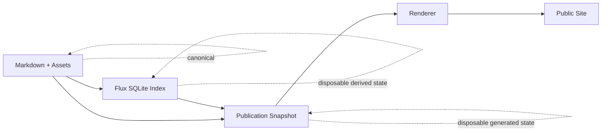

Neither the publication snapshot nor the generated website becomes canonical.

The user can delete and regenerate both.

---

## 6.2 Flux Owns Semantic Resolution

Renderers must not decide independently:

- What `[[Raft]]` means.
- Which note a link resolves to.
- Whether duplicate filenames are ambiguous.
- What backlinks exist.
- Which notes form graph edges.
- Which notes are publishable.
- Whether a private note should appear in a graph.

Those decisions belong to Flux.

---

## 6.3 Rendering and Deployment Are Separate Concerns

A renderer converts a Publication Snapshot into a site representation.

A deployer moves that representation somewhere.

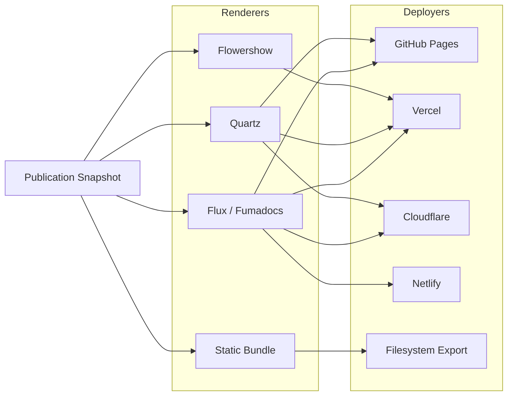

Do not model combinations such as:

```text
QuartzVercelPublisher
QuartzGitHubPublisher
FluxVercelPublisher
FluxCloudflarePublisher
```

That creates an N × M explosion.

Model:

```text
Renderer
+
DeploymentProvider
```

independently.

---

# 7. Security Boundary: Publish a Snapshot, Never the Vault

This is one of the most important rules in this design.

The deployed Fumadocs application MUST NOT receive unrestricted access to the entire
vault repository.

Bad:

```text
private vault repo
       |
       v
Fumadocs build
       |
       +-- decides what is public
```

A framework bug, custom component, build script, or accidental import could expose private
files.

Correct:

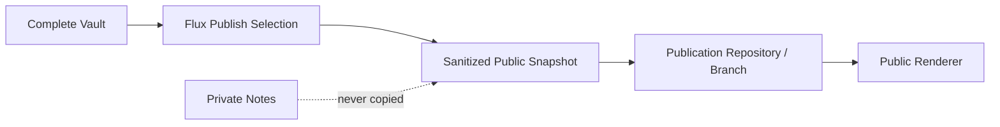

The public renderer only receives material Flux has already approved for publication.

This is a **fail-closed** model.

---

# 8. Publication Model

A vault may contain multiple publications.

Example:

```text
Vault: Shashank Knowledge Base

Publication A
  name: Engineering Garden
  domain: engineering.example.com

Publication B
  name: University Notes
  domain: notes.example.com

Publication C
  name: Public Blog
  renderer: Quartz
```

Define:

```ts
interface Publication {
  id: string;
  vaultId: string;

  name: string;

  selection: PublicationSelection;

  renderer: RendererConfig;

  deployment?: DeploymentConfig;

  site: SiteConfig;

  createdAt: string;
  updatedAt: string;
}
```

Publication IDs should use UUIDv7.

---

# 9. Publication Configuration

Durable non-secret configuration can live in:

```text
.flux/config.json
```

Example:

```json
{
  "publish": {
    "publications": [
      {
        "id": "01991bb8-...",
        "name": "Engineering Garden",
        "selection": {
          "default": "private",
          "include": [
            "engineering/**",
            "research/**"
          ],
          "exclude": [
            "**/*.draft.md",
            "private/**"
          ],
          "frontmatterKey": "publish"
        },
        "renderer": {
          "id": "flux"
        },
        "site": {
          "title": "Engineering Garden",
          "basePath": "/",
          "theme": "system"
        }
      }
    ]
  }
}
```

Secrets MUST NOT live here.

---

# 10. Selection Rules

Publishing defaults should be conservative.

Recommended default:

```text
default = private
```

Notes become public through:

- Explicit UI selection.
- Folder include rule.
- Glob include rule.
- Tag rule.
- `publish: true`.
- Publication-specific configuration.

Example:

```yaml
---
title: Consensus Algorithms
publish: true
---
```

Explicit deny:

```yaml
---
publish: false
---
```

Authoritative evaluation order, from strongest to weakest:

1. Hard exclusions reject the path unconditionally.
2. `publish: false` rejects the note.
3. A publication `exclude` rule rejects the note.
4. Explicit UI selection for this publication selects the note.
5. `publish: true` selects the note.
6. A matching folder, glob, or tag `include` rule selects the note.
7. The publication default decides.

An explicit deny therefore always wins over an explicit allow. The same rules must be
used by preview, export, and publish; renderers must not evaluate selection again.

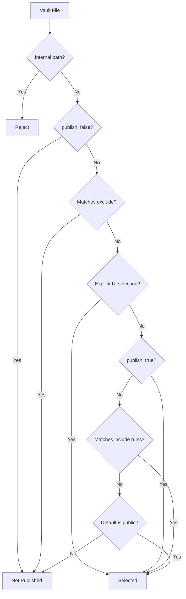

Hard exclusions always include normalized vault-relative paths matching:

```text
.flux/**
.git/**
.obsidian/**
**/.DS_Store
**/*~
**/*.swp
**/*.swo
**/.#*
```

Resolve symlinks before selection and reject any target outside the vault root. Directories
named `trash` are not special unless configured; Flux-managed trash is already covered by
`.flux/**`.

Archive remains excluded by default but may be explicitly included.

---

# 11. Link and Embed Privacy

Consider:

```markdown
# Distributed Systems

See [[Private Interview Notes]].
```

Suppose the current page is public but the target note is private.

Flux must never automatically publish the target merely because it is linked.

Default rendering:

```text
Private Interview Notes
```

or:

```text
Private Interview Notes  [unpublished]
```

depending on user preference.

The graph MUST NOT include a private node.

Backlinks MUST NOT expose private source documents.

Search MUST NOT expose private text.

Hover previews MUST NOT expose private content.

---

## 11.1 Embedded Notes

More dangerous:

```markdown
![[Private Interview Notes]]
```

Default behavior:

```text
BUILD WARNING:
Embedded note is not included in publication.
```

The content MUST NOT be silently transcluded.

Options:

```text
Unpublished embeds:
    ● Fail closed with placeholder
    ○ Fail publication
    ○ Explicitly include transitive embeds
```

The default remains fail closed.

---

## 11.2 Attachments

Referenced binary attachments may be automatically included if:

- They are directly referenced from a published note.
- They are not explicitly denied.
- They do not reside in internal Flux directories.

Flux should show the user the automatically included attachment set before first publish.

---

# 12. Publication Snapshot / Intermediate Representation

The renderer-neutral contract is the core of this architecture.

Do not expose the internal SQLite database.

Generate:

```text
PublicationSnapshot
```

Example generated cache:

```text
.flux/
└── cache/
    └── publish/
        └── <publication-id>/
            └── <snapshot-id>/
                ├── manifest.json
                ├── graph.json
                ├── backlinks.json
                ├── navigation.json
                ├── pages/
                │   ├── engineering/
                │   │   └── raft.md
                │   └── index.md
                └── assets/
                    └── ...
```

The directory is derived state and may always be deleted.

---

# 13. Stable Publication Contract

Create:

```text
packages/publish-contract
```

Do not reuse `bridge-contract` as the public publishing contract.

`bridge-contract` describes communication between Flux application runtimes.

`publish-contract` describes communication between:

```text
Flux Publish Core
        and
Public Renderers
```

These version independently.

Example:

```ts
export interface PublicationManifest {
  schemaVersion: 1;

  publication: {
    id: string;
    name: string;
    title: string;
  };

  snapshot: {
    id: string;
    contentHash: string;
  };

  pages: PublicationPage[];

  assets: PublicationAsset[];

  navigation: NavigationNode[];

  graph: {
    path: string;
  };

  backlinks: {
    path: string;
  };
}
```

Page:

```ts
export interface PublicationPage {
  id: string;

  contentPath: string;
  outputPath: string;
  slug: string;

  title: string;
  description?: string;

  tags: string[];
  aliases: string[];

  contentHash: string;

  createdAt?: string;
  modifiedAt?: string;

  outgoing: PublicationLink[];

  toc: PublicationHeading[];

  draft: boolean;
}
```

The public contract MUST NOT contain vault revisions or source vault paths. `id` is an
opaque publication-local identifier and `contentPath` points only to sanitized content
inside the snapshot bundle. Source paths, source revisions, generation timestamps, and
the source-to-public diagnostic map belong to the private publish-job record. They may be
used for diagnostics but must never be copied to a renderer, repository, or deployment.

Link:

```ts
export interface PublicationLink {
  text: string;
  rawTarget: string;

  type:
    | "wiki"
    | "markdown"
    | "embed"
    | "attachment";

  resolvedPageId?: string;
  resolvedSlug?: string;

  status:
    | "published"
    | "unpublished"
    | "missing"
    | "ambiguous";
}
```

---

# 14. Why a Separate Publication Contract Matters

Without a stable IR:

```text
Flux version X
    |
    +--> Quartz-specific logic
    +--> Flowershow-specific logic
    +--> Fumadocs-specific logic
```

Each renderer begins implementing its own interpretation of Flux.

Eventually:

```text
[[Some Link]]
```

could resolve differently between three publication formats.

The IR avoids this.

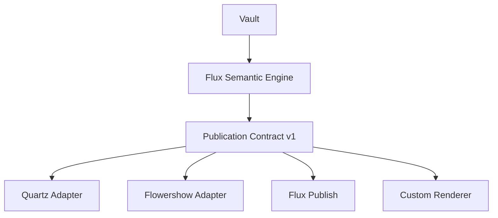

---

# 15. Publication Snapshot Generation

Existing Flux already contains:

- File inventory.
- Link extraction.
- Link resolution.
- Graph generation.
- FTS.
- Tags.
- Property keys.
- Contextual references.

Reuse those facilities.

However, the current reference API is optimized for interactive per-document queries.

Publishing every page with:

```text
getGraph()
references(page1)
references(page2)
references(page3)
...
```

would be inefficient.

Add a bulk publication projection to the index.

Suggested:

```go
type KnowledgeSnapshot struct {
    Files      []PublishedFile
    Graph      domain.VaultGraph
    Backlinks  map[string][]Reference
    Outgoing   map[string][]ResolvedLink
    Facets     PublicationFacets
}
```

API:

```go
func (s *Store) BuildPublicationKnowledge(
    selectedPaths []string,
) (KnowledgeSnapshot, error)
```

It should:

1. Resolve the graph once.
2. Filter graph nodes to published content.
3. Resolve backlinks in bulk.
4. Collect reference excerpts.
5. Collect tags.
6. Generate outgoing-link metadata.
7. Drop all non-public source metadata.

---

# 16. Snapshot Consistency

Flux must not lock the user's editor during a publish build.

Use optimistic snapshot consistency with bounded verification.

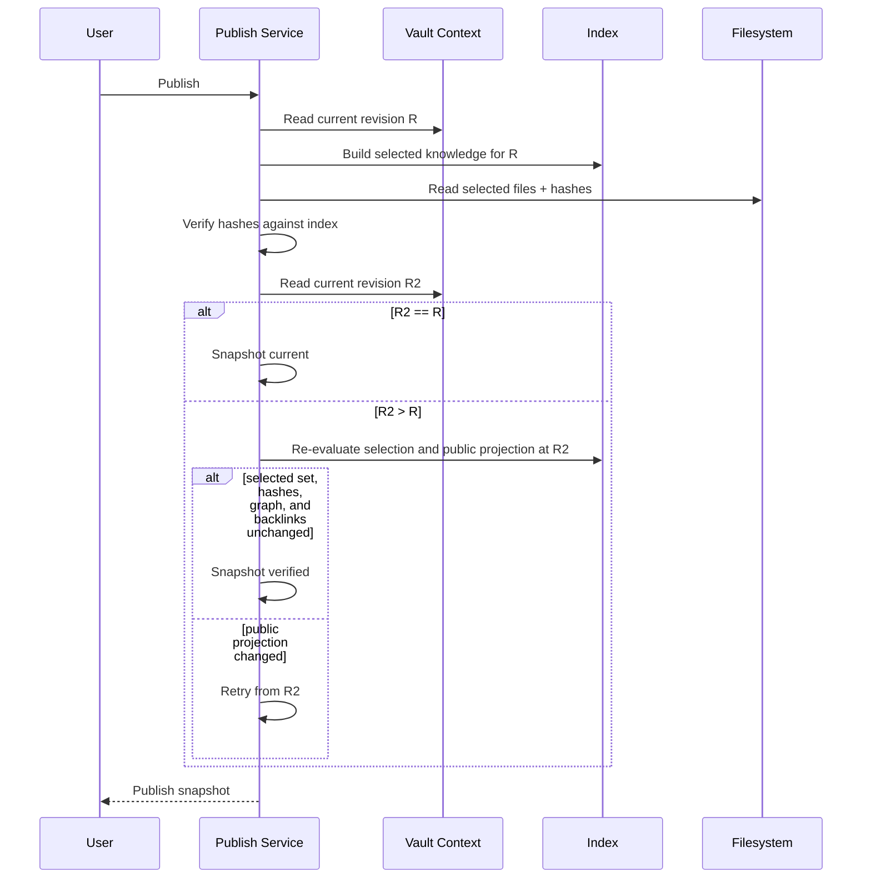

A publish represents a specific immutable public projection, not merely a whole-vault
revision. A private or otherwise unselected edit must not invalidate an unchanged public
projection.

Retry verification at most three times. If the selected set, selected content hashes, or
public graph/backlink projection keeps changing, fail closed with a retryable "vault is
changing" error. Never publish a partially verified snapshot.

If the vault changes while deployment is happening:

```text
Published revision: 1032
Current revision:   1037
```

Flux can display:

```text
5 newer changes are not published.
```

Optionally queue another publication.

Do not restart an active publish indefinitely whenever the vault changes.

---

# 17. Idempotent Publishing

Building the same public projection from:

```text
publication configuration
+
selected public content and assets
+
public graph and backlink projection
```

should produce the same snapshot hash.

Define:

```text
snapshotHash =
    SHA256(
        schemaVersion
        + normalizedPublicationConfig
        + orderedPageHashes
        + orderedAssetHashes
        + semanticGraphHash
    )
```

Rendering is deterministic separately:

```text
artifactHash =
    SHA256(
        snapshotHash
        + rendererId
        + rendererVersion
        + normalizedRendererConfig
    )
```

If:

```text
newSnapshotHash == lastPublishedSnapshotHash
```

then Flux may return:

```text
Already up to date.
```

No redundant Git commit is necessary.

Whole-vault revision, generation time, job ID, diagnostics, and private source paths MUST
NOT contribute to either hash. They remain private job metadata. Renderer version
contributes only to the rendered-artifact hash, not the renderer-neutral snapshot hash.

This is the correct place for idempotency.

---

# 18. Publication and Job Lifecycle

Publication state:

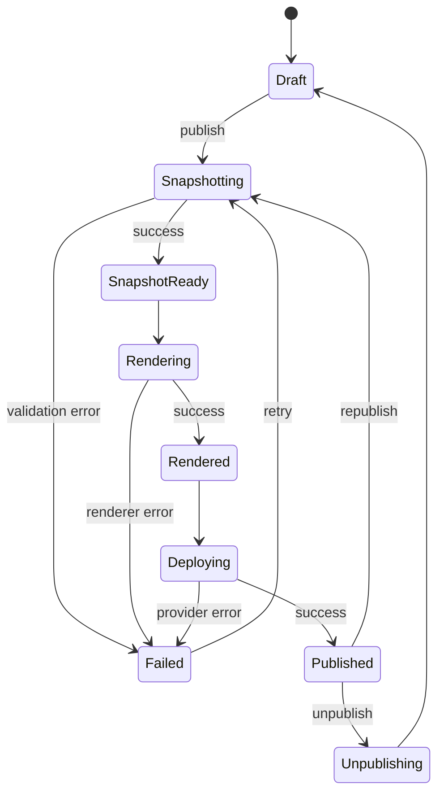

Jobs are separate from publication state:

```ts
type PublishJobKind = "preview" | "publish" | "unpublish";

type PublishJobStatus =
  | "queued"
  | "snapshotting"
  | "rendering"
  | "deploying"
  | "ready"
  | "succeeded"
  | "failed"
  | "cancelled";
```

`ready` means a preview artifact is available. `succeeded` means a publish or unpublish
operation completed. A job record may expose a preview artifact reference or deployment
result according to its kind, never both.

---

# 19. Backend Module

Start Phase 1 with:

```text
server/internal/publish/
├── service.go
├── selection.go
├── snapshot.go
├── manifest.go
└── validation.go
```

Add jobs, renderer integration, deployment, and secrets only in the phase that first uses
them. Do not scaffold provider or adapter directories for future integrations.

Do not put all publication behavior inside:

```text
server/internal/app/service.go
```

That file is already an orchestration surface.

Publishing deserves its own bounded backend module.

---

# 20. Renderer Interface

Conceptually:

```go
type Renderer interface {
    ID() string

    Validate(
        context.Context,
        PublicationSnapshot,
        RendererConfig,
    ) error

    Render(
        context.Context,
        PublicationSnapshot,
        RenderWorkspace,
        RendererConfig,
    ) (RenderArtifact, error)
}
```

The renderer never receives:

```text
vault root
```

It receives:

```text
PublicationSnapshot
```

This maintains the privacy boundary.

---

# 21. Deployment Provider Interface

```go
type DeploymentProvider interface {
    ID() string

    Validate(
        context.Context,
        DeploymentConfig,
    ) error

    Deploy(
        context.Context,
        RenderArtifact,
        DeploymentConfig,
    ) (DeploymentResult, error)

    Status(
        context.Context,
        DeploymentReference,
    ) (DeploymentStatus, error)

    Unpublish(
        context.Context,
        DeploymentReference,
    ) error
}
```

No renderer should contain Vercel/GitHub/Cloudflare-specific logic.

---

# 22. First-Party Flux Renderer

The default renderer ID:

```text
flux
```

Implementation:

```text
Next.js App Router
+
Fumadocs Core
+
selected Fumadocs UI primitives
+
Flux publish-contract
+
Flux markdown engine
+
Flux graph UI
+
custom Flux layout
```

Do NOT simply deploy the stock Fumadocs docs layout.

---

# 23. Why Fumadocs Is an Infrastructure Choice

The public experience should look like:

```text
Flux Publish
```

not:

```text
Fumadocs with a Flux logo
```

Fumadocs provides useful primitives:

- Page trees.
- Routing support.
- Search primitives.
- Docs typography.
- TOC infrastructure.
- Layout primitives.
- Server-side source loader.

Flux supplies:

- Content semantics.
- Graph.
- Backlinks.
- Knowledge navigation.
- Wiki links.
- Embeds.
- Publish filters.
- Hover previews.
- Public/private boundaries.
- Flux visual identity.

---

# 24. First-Party Site Layout

Desktop:

```text
┌──────────────────────────────────────────────────────────────────────────┐
│ Logo / Garden                     Search                     Theme       │
├───────────────────┬────────────────────────────────────┬─────────────────┤
│                   │                                    │                 │
│   EXPLORER        │                                    │  LOCAL GRAPH    │
│                   │                                    │                 │
│   ▾ Engineering   │                                    │       ○──○      │
│      Raft         │           ARTICLE                  │      /   │      │
│      Paxos        │                                    │     ○────○      │
│      Gossip       │      # Consensus Algorithms        │                 │
│                   │                                    ├─────────────────┤
│   ▾ Databases     │      ...                           │                 │
│      MVCC         │                                    │  ON THIS PAGE   │
│      LSM          │                                    │                 │
│                   │                                    │  Introduction   │
│                   │                                    │  Raft           │
│                   │                                    │  Paxos          │
│                   │                                    ├─────────────────┤
│                   │                                    │                 │
│                   │                                    │  BACKLINKS      │
│                   │                                    │                 │
└───────────────────┴────────────────────────────────────┴─────────────────┘
```

The right rail may be configurable:

```text
Right Rail
    Graph
    TOC
    Backlinks
    Properties
```

---

# 25. Mobile Layout

```text
┌───────────────────────────────┐
│ ☰   Engineering Garden  🔎 ☾ │
├───────────────────────────────┤
│                               │
│ # Consensus Algorithms        │
│                               │
│ ...                           │
│                               │
│                               │
├───────────────────────────────┤
│ Related                       │
│                               │
│ Local graph                   │
│ Backlinks                     │
│ Table of contents             │
└───────────────────────────────┘
```

Graph rendering must not force desktop-width layouts.

---

# 26. Fumadocs Content Source

`apps/publish` should read the Publication Snapshot through a custom source.

Concept:

```ts
import { loader } from "fumadocs-core/source";
import { fluxPublicationSource } from "@/lib/flux-publication-source";

export const source = loader({
  source: fluxPublicationSource(snapshot),
  baseUrl: "/"
});
```

The renderer receives only virtual/public files.

It does not crawl the vault.

Keep this adapter local to `apps/publish` until a second first-party consumer needs it.
Do not create a separate runtime package for one implementation.

---

# 27. First-Party Publish App Structure

```text
apps/publish/
├── app/
│   ├── [[...slug]]/
│   │   └── page.tsx
│   ├── graph/
│   │   └── page.tsx
│   ├── tags/
│   │   └── [tag]/
│   │       └── page.tsx
│   ├── layout.tsx
│   ├── sitemap.ts
│   └── feed.xml/
│
├── components/
│   ├── publish-layout.tsx
│   ├── article.tsx
│   ├── explorer.tsx
│   ├── backlinks.tsx
│   ├── local-graph.tsx
│   ├── global-graph.tsx
│   ├── hover-preview.tsx
│   ├── properties.tsx
│   ├── tags.tsx
│   └── search.tsx
│
├── lib/
│   ├── publication.ts
│   ├── source.ts
│   ├── routing.ts
│   └── metadata.ts
│
└── next.config.ts
```

---

# 28. Markdown Rendering

The current Flux Reading View contains important functionality:

- MarkdownIt.
- Wiki links.
- Internal embeds.
- Obsidian comments.
- Block refs.
- Tags.
- KaTeX.
- Mermaid.
- Callouts.
- Footnotes.
- Task lists.
- Syntax highlighting.
- HTML sanitization.

That parser currently lives inside:

```text
packages/app-core/src/reading-view.tsx
```

and is coupled to React/browser concerns.

Do not implement another independent Markdown parser for publishing.

Refactor the semantic parts.

Target:

```text
packages/markdown-engine/
├── src/
│   ├── create-engine.ts
│   ├── wikilinks.ts
│   ├── embeds.ts
│   ├── callouts.ts
│   ├── headings.ts
│   ├── tags.ts
│   ├── sanitization.ts
│   ├── mermaid.ts
│   └── types.ts
```

Consumers:

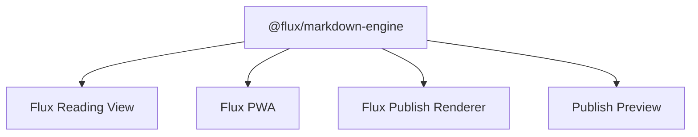

Desktop/browser hydration and server rendering may use different adapters, but parsing
semantics remain shared.

---

# 29. Internal Link Rewriting

The public site must never resolve wiki links using filename heuristics independently.

Flux Snapshot already knows:

```json
{
  "rawTarget": "Raft",
  "resolvedPageId": "engineering/raft.md",
  "resolvedSlug": "/engineering/raft",
  "status": "published"
}
```

Renderer output:

```html
<a href="/engineering/raft">
  Raft
</a>
```

For unpublished target:

```json
{
  "rawTarget": "Private Notes",
  "status": "unpublished"
}
```

Renderer must not guess.

---

# 30. Graph Architecture

Flux currently has a real graph implementation backed by the Go index and rendered in
the app with a D3 force simulation and Pixi.

Do not introduce a completely separate graph implementation unless necessary.

Refactor the reusable rendering layer.

Target:

```text
packages/graph-ui/
├── graph-canvas.tsx
├── graph-model.ts
├── graph-filters.ts
├── graph-controls.tsx
└── graph-theme.ts
```

Product-specific wrappers:

```text
app-core/GraphView
publish/LocalGraph
publish/GlobalGraph
```

---

# 31. Public Graph Filtering

The public graph is NOT:

```text
vault graph
```

It is:

```text
induced subgraph of published nodes
```

Formally:

```text
G = (V, E)

P ⊆ V

G_public = G[P]
```

where:

```text
P = set of publicly selected nodes
```

Edges with an unpublished endpoint are dropped.

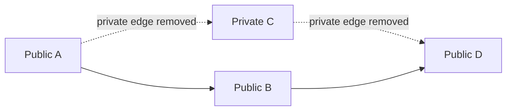

The final snapshot contains only:

```text
A -> B
B -> D
```

It contains no node metadata for `C`.

---

# 32. Local Graph

Every public page may request an adjacency graph.

Configurable depth:

```text
1 hop
2 hops
3 hops
```

Default:

```text
1 hop
```

Filters:

- Incoming.
- Outgoing.
- Tags.
- Attachments.
- Unresolved links.
- Orphans.
- Folder.
- Node type.

The server/publication generator can precompute adjacency lists.

Example:

```json
{
  "engineering/raft.md": {
    "incoming": [
      "engineering/consensus.md"
    ],
    "outgoing": [
      "engineering/log-replication.md"
    ]
  }
}
```

---

# 33. Global Graph

Dedicated route:

```text
/graph
```

Graph payload should be lazy-loaded.

Do not include the entire graph JSON in every article page.

Suggested:

```text
/static/flux/graph.v1.json
```

For small gardens:

```text
< 1000 nodes
```

load directly.

For larger gardens:

```text
1000+
```

use:

- Lazy loading.
- Compressed JSON.
- WebGL/Pixi rendering.
- Label culling.
- Progressive label rendering.
- Query-based filtering.
- Optional graph partitions later.

---

# 34. Backlinks

The existing index can produce contextual linked references.

The public experience should use them.

Bad:

```text
Backlinks

- Consensus
- Distributed Systems
```

Better:

```text
Backlinks

Consensus Algorithms
"...Raft provides a leader-oriented approach to consensus..."

Distributed Systems
"...systems such as Paxos and Raft..."
```

Public backlink generation MUST only include public sources.

---

# 35. Bulk Backlink Generation

Do not call the interactive reference query N times for N notes.

Add a publication-specific bulk path.

Pseudo-flow:

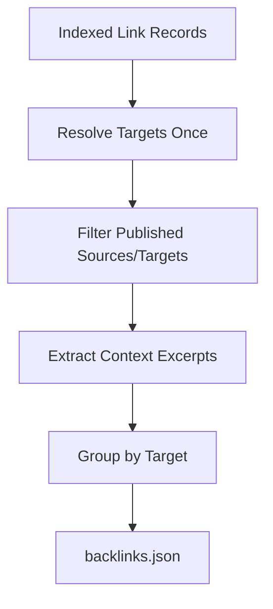

---

# 36. Hover Previews

Hovering:

```text
[[Raft]]
```

should display:

```text
┌──────────────────────────────────────┐
│ Raft                                 │
│                                      │
│ Raft is a replicated consensus ...   │
│                                      │
│ #distributed-systems #consensus      │
└──────────────────────────────────────┘
```

Preview content should be generated only from public pages.

Potential manifest field:

```json
{
  "preview": {
    "title": "Raft",
    "excerpt": "Raft is a replicated consensus...",
    "tags": [
      "distributed-systems",
      "consensus"
    ]
  }
}
```

Avoid shipping every page body in one massive preview index.

---

# 37. Search

The public search index is generated from selected content only.

Possible first-party implementation:

```text
Orama
```

or another static client-side search backend.

Index:

```text
title
body
headings
tags
aliases
path
description
```

Do not publish the internal SQLite FTS database.

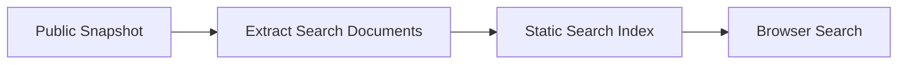

Later Flux may optionally add semantic search.

That is not required for Publish v1.

---

# 38. Navigation

Navigation should support:

### Filesystem mode

```text
Engineering
├── Distributed Systems
│   ├── Raft
│   ├── Paxos
│   └── Gossip
└── Databases
    ├── MVCC
    └── LSM
```

### Manual mode

Manual navigation lives in the publication's `site.navigation` field in
`.flux/config.json`; it is not inferred from an additional YAML file.

```json
{
  "site": {
    "navigation": [
      { "page": "/" },
      {
        "label": "Engineering",
        "children": [
          { "page": "/engineering/distributed-systems" },
          { "page": "/engineering/databases" }
        ]
      }
    ]
  }
}
```

### Mixed mode

Allow specific folders to be manually ordered while the rest follow the vault.

Navigation is part of Publication Snapshot semantics.

Navigation entries reference normalized public slugs, never source paths. A reference to
an unpublished or missing page fails validation. Mixed mode uses an explicit `"auto"`
child entry; renderers consume the resolved `navigation` artifact and do not interpret
configuration themselves.

---

# 39. Slugs and Permalinks

Default:

```text
engineering/raft.md
```

becomes:

```text
/engineering/raft
```

Allow:

```yaml
---
slug: /raft
---
```

or:

```yaml
---
permalink: /distributed-systems/raft
---
```

Rules:

- Slugs are publication-specific.
- Slug collisions fail the build.
- Absolute external URLs are not valid slugs.
- Path traversal is invalid.
- Slugs should remain stable until explicitly changed.

---

# 40. Redirects

Later publication revisions should retain previous permalinks where possible.

Example:

```text
/engineering/raft
        |
        | note moved
        v
/distributed-systems/raft
```

Manifest:

```json
{
  "redirects": {
    "/engineering/raft": "/distributed-systems/raft"
  }
}
```

V1 may initially support manually defined aliases if automatic move history is not yet
stable enough.

---

# 41. Site Metadata

Site config:

```ts
interface SiteConfig {
  title: string;
  description?: string;

  logo?: string;
  favicon?: string;

  theme: "light" | "dark" | "system";

  homepage?: string;

  socialImage?: string;

  language?: string;

  graph: {
    enabled: boolean;
    global: boolean;
    local: boolean;
  };

  backlinks: {
    enabled: boolean;
  };

  toc: {
    enabled: boolean;
  };
}
```

---

# 42. Customization

The Flux first-party renderer should provide two levels.

## Level 1 — Flux UI Configuration

Users can change:

- Site title.
- Logo.
- Favicon.
- Accent.
- Typography.
- Navigation.
- Sidebar behavior.
- Graph visibility.
- TOC.
- Backlinks.
- Footer.
- Social links.
- Custom domain.
- Custom CSS.

No coding required.

---

## Level 2 — Fumadocs / Code Customization

Advanced users may own the site repository.

They may:

- Modify layout.
- Add React components.
- Change Fumadocs configuration.
- Install packages.
- Replace search.
- Add analytics.
- Add custom routes.
- Completely redesign the site.

Flux only updates generated content boundaries.

---

# 43. Generated Content Boundary

If a single site repository is used, generated files must be isolated.

Example:

```text
my-flux-site/
├── app/
├── components/
├── package.json
├── next.config.ts
│
└── .flux-content/
    ├── manifest.json
    ├── graph.json
    ├── backlinks.json
    ├── navigation.json
    ├── pages/
    └── assets/
```

Flux owns:

```text
.flux-content/**
```

User owns:

```text
everything else
```

Flux must never overwrite arbitrary application code during content publication.

---

# 44. Recommended Repository Models

Support two modes.

## 44.1 Simple Mode

One repository:

```text
site code
+
generated public content
```

Best for:

- Most users.
- One-click publishing.
- GitHub Pages/Vercel/Cloudflare.
- Simple customization.

---

## 44.2 Advanced Split Mode

Two repositories:

```text
Site Repository
    |
    | custom Next/Fumadocs code
    |
    +---------------------+
                          |
                          v
                    Deployment Build
                          ^
                          |
Publication Repository ---+
    |
    | generated content only
```

Advantages:

- Code and content have independent histories.
- Flux cannot conflict with custom site code.
- Publication repo contains no build dependencies.
- One site can consume different content sources.

---

# 45. Publication Repository

A generated content repository might contain:

```text
flux-publication/
├── flux-publication.json
├── manifest.json
├── graph.json
├── backlinks.json
├── navigation.json
├── pages/
└── assets/
```

`flux-publication.json`:

```json
{
  "schemaVersion": 1,
  "generator": "flux",
  "publicationId": "01991bb8-...",
  "snapshot": "sha256:..."
}
```

---

# 46. Build-Time Content Fetching

The deployed Fumadocs application should consume publication content at build time.

Do NOT do:

```text
GET /engineering/raft
        |
        v
GitHub API
        |
        v
download raft.md
```

Do:

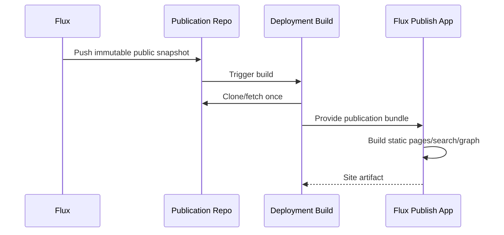

This prevents:

- GitHub API rate-limit dependence.
- Runtime latency.
- Runtime authentication problems.
- Public site failures when GitHub API is degraded.
- One remote fetch per page.

---

# 47. Git Integration

Publishing Git operations should use the same structured Git philosophy as Flux VCS.

Never accept:

```text
custom shell command:
"npm blah && curl blah && ..."
```

Allowed controlled operations:

```text
clone
fetch
checkout
add generated paths
commit
push
```

Git mutation is serialized per publication repository.

---

# 48. Git Worktrees / Generated Checkout

Do not build renderer output inside the user's vault.

Use application-owned working directories.

Example:

```text
<app-data>/
└── publish/
    ├── repositories/
    │   └── <publication-id>/
    ├── workspaces/
    │   └── <job-id>/
    └── logs/
```

Temporary render workspaces are disposable.

---

# 49. Git Commit Strategy

Generated commit example:

```text
publish: update Engineering Garden

Flux-Publication: 01991bb8-...
Flux-Snapshot: sha256:123...
Vault-Revision: 1032
```

Do not commit if output hash is unchanged.

---

# 50. Renderer Adapters

## 50.1 Flux Renderer

```text
Publication Snapshot
    |
    v
Flux/Fumadocs Source Adapter
    |
    v
Next.js + Flux Publish UI
```

Best default.

---

## 50.2 Quartz Adapter

```text
Publication Snapshot
    |
    v
Quartz Adapter
    |
    +-- content/
    +-- config mapping
    +-- static assets
    |
    v
Quartz build environment
```

Quartz owns its rendering implementation.

Flux continues to own public selection and semantic filtering.

---

## 50.3 Flowershow Adapter

```text
Publication Snapshot
    |
    v
Flowershow Adapter
    |
    v
Flowershow-compatible content
```

Same privacy boundary.

---

## 50.4 Custom Renderer

Initial custom support can simply expose:

```text
Publication Bundle v1
```

Users can consume it from any application.

A generic arbitrary-script adapter should not be introduced initially.

---

# 51. Renderer Capability Discovery

Renderers should expose capabilities.

Example:

```json
{
  "id": "quartz",
  "capabilities": {
    "graph": true,
    "backlinks": true,
    "customLayout": true,
    "staticExport": true,
    "serverRequired": false
  }
}
```

Flux UI can disable unsupported settings.

---

# 52. Deployment Providers

Possible built-ins:

```text
filesystem
github-pages
vercel
cloudflare-pages
netlify
```

Provider configuration is separate from publication renderer configuration.

Example:

```json
{
  "deployment": {
    "provider": "vercel",
    "projectId": "...",
    "secretRef": "secret://publish/..."
  }
}
```

---

# 53. Credentials

Never store:

```text
GitHub tokens
Vercel tokens
Cloudflare API tokens
Netlify tokens
SSH private keys
```

inside:

```text
vault
.flux/config.json
publication manifest
site repository
```

Desktop:

```text
OS keychain / credential manager
```

Self-hosted:

```text
mounted secrets
environment
external secret provider
```

Only an opaque secret reference is stored with publication configuration.

---

# 54. Publication Control Plane API

Extend the product control plane.

Suggested REST endpoints:

```text
GET    /api/v1/vaults/:vaultId/publications

POST   /api/v1/vaults/:vaultId/publications

GET    /api/v1/vaults/:vaultId/publications/:publicationId

PUT    /api/v1/vaults/:vaultId/publications/:publicationId

DELETE /api/v1/vaults/:vaultId/publications/:publicationId


POST   /api/v1/vaults/:vaultId/publications/:publicationId/preview

POST   /api/v1/vaults/:vaultId/publications/:publicationId/publish

POST   /api/v1/vaults/:vaultId/publications/:publicationId/unpublish


GET    /api/v1/vaults/:vaultId/publications/:publicationId/jobs

GET    /api/v1/vaults/:vaultId/publications/:publicationId/jobs/:jobId


GET    /api/v1/publish/renderers

GET    /api/v1/publish/providers
```

Lifecycle semantics:

- `unpublish` removes the remote deployment while preserving publication configuration,
  history, and credentials.
- `DELETE` removes local publication configuration only after the publication is already
  unpublished, or when the request explicitly confirms that the remote deployment should
  be removed first.
- A failed unpublish must leave both the live deployment and local configuration intact.
- Preview and publish are asynchronous jobs. They return a job immediately; completed
  preview jobs expose a local preview URL or artifact reference.

---

# 55. FluxClient Extensions

Extend:

```text
packages/bridge-contract/src/index.ts
```

Example:

```ts
interface FluxClient {
  // existing methods...

  listPublications(
    vaultId: string
  ): Promise<Publication[]>;

  createPublication(
    vaultId: string,
    request: CreatePublicationRequest
  ): Promise<Publication>;

  updatePublication(
    vaultId: string,
    publicationId: string,
    request: UpdatePublicationRequest
  ): Promise<Publication>;

  deletePublication(
    vaultId: string,
    publicationId: string
  ): Promise<void>;

  previewPublication(
    vaultId: string,
    publicationId: string
  ): Promise<PublishJob>;

  publishPublication(
    vaultId: string,
    publicationId: string
  ): Promise<PublishJob>;

  getPublishJob(
    vaultId: string,
    publicationId: string,
    jobId: string
  ): Promise<PublishJob>;

  unpublishPublication(
    vaultId: string,
    publicationId: string
  ): Promise<void>;
}
```

Both:

```text
client-desktop
client-web
```

must implement the same contract.

---

# 56. API Source Layout

The current `routes.go` is already carrying substantial routing logic.

Do not continue expanding it indefinitely.

Suggested:

```text
server/internal/api/
├── routes.go
├── vault_routes.go
├── plugin_routes.go
├── mcp_routes.go
└── publish_routes.go
```

At minimum, publication routes should live in:

```text
publish_routes.go
```

with registration from the main router.

---

# 57. Publication Preview

Flux should support preview before deploying.

Preview stages:

```text
Select content
      |
      v
Generate Snapshot
      |
      v
Preview
      |
      +-- pages
      +-- graph
      +-- backlinks
      +-- navigation
      +-- theme
      |
      v
Publish
```

For the first-party renderer, preview should use the same:

```text
@flux/publish-ui
@flux/markdown-engine
@flux/graph-ui
```

components used by the deployed site.

This avoids a fake preview.

---

# 58. Preview UX

```text
┌──────────────────────────────────────────────────┐
│ Publish Preview                    Publish →      │
├──────────────────────────────────────────────────┤
│                                                  │
│     [ live public-site preview ]                 │
│                                                  │
├──────────────────────────────────────────────────┤
│  132 notes       18 assets       344 links       │
│                                                  │
│  ⚠ 3 unpublished links                          │
│  ⚠ 1 excluded embed                             │
└──────────────────────────────────────────────────┘
```

Warnings should be visible before deployment.

---

# 59. Publish UI

Suggested entry:

```text
Settings
└── Publishing
```

and command palette:

```text
Publish current vault...
Publish current note...
Open publish preview...
```

Possible wizard:

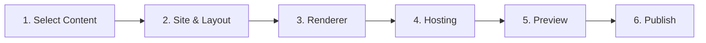

---

# 60. Publish Configuration UI

```text
Publish "Engineering Garden"

Content
  ● Selected folders and notes
  ○ Entire vault

Included
  ✓ engineering/**
  ✓ research/**

Excluded
  ✓ private/**
  ✓ **/*.draft.md

Renderer
  ● Flux
  ○ Quartz
  ○ Flowershow
  ○ Bundle only

Hosting
  ● GitHub Pages
  ○ Vercel
  ○ Cloudflare Pages
  ○ Netlify
  ○ Export only

Knowledge features
  ✓ Search
  ✓ Backlinks
  ✓ Local graph
  ✓ Global graph
  ✓ Hover previews
  ✓ Tags

[ Preview ]                          [ Publish ]
```

---

# 61. Graph Customization

First-party renderer:

```text
Graph
  Local graph                  on
  Global graph                 on

  Show tags                    off
  Show attachments             off
  Show unresolved links        off

  Default local depth          1

  Node labels                  on
  Direction arrows             off

  Orphans                      on
```

The graph UI should reuse Flux graph behavior wherever sensible.

---

# 62. Custom Graph Layout

The Fumadocs page layout should expose slots:

```tsx
<FluxPublishLayout
  explorer={<Explorer />}
  article={<Article />}
  rightRail={
    <>
      <LocalGraph />
      <TableOfContents />
      <Backlinks />
    </>
  }
/>
```

Users who eject/customize the Fumadocs layout can rearrange these completely.

---

# 63. Search and Graph Are Publication Features

Do not make these renderer responsibilities semantically.

Meaning:

```text
Flux generates:
    what nodes exist
    what edges exist
    what backlinks exist
    what pages exist

Renderer chooses:
    how to draw nodes
    how to style backlinks
    where search appears
```

---

# 64. Publication State Storage

Recommended:

```text
Vault
└── .flux/
    ├── config.json
    └── cache/
        └── publish/
            └── ...
```

Global application state:

```text
App Data
└── publish/
    ├── repositories/
    ├── jobs/
    └── provider-state/
```

OS keychain:

```text
publish credentials
```

---

# 65. What Must Never Enter a Publication Snapshot

Explicit deny list:

```text
.flux/**
.git/**
.obsidian/**
recovery/**
trash/**
plugin state
MCP credentials
provider credentials
Git credentials
workspace state
application settings
SQLite index
unsaved editor buffers
```

Only canonical saved vault data may be published.

---

# 66. Unsaved Editor State

Publishing should operate on saved canonical state.

If selected documents have unsaved buffers:

```text
3 selected notes contain unsaved changes.

○ Save and publish
○ Publish last saved versions
○ Cancel
```

Default should not silently publish an unexpected disk version.

---

# 67. Failure Isolation

Publish failures must not affect note editing.

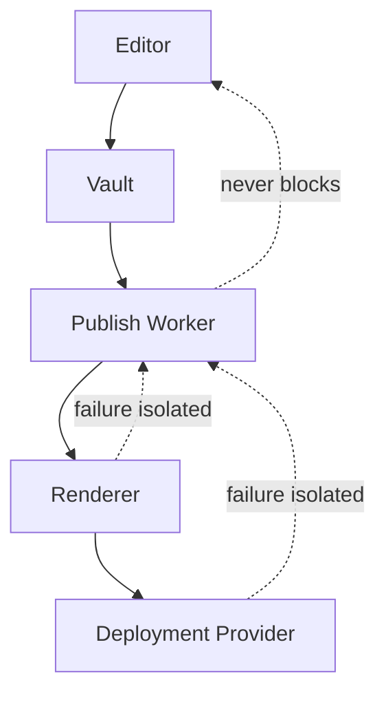

Examples:

- GitHub is down → editing works.
- Vercel build fails → editing works.
- Graph generation fails → publish job fails/degrades.
- Quartz adapter crashes → first-party publishing remains available.

---

# 68. Retry Policy

Safe automatic retries:

```text
network timeout
provider 5xx
temporary Git fetch failure
status polling failure
```

Do NOT automatically retry:

```text
invalid publication selection
slug collision
private embed policy violation
renderer config error
authentication failure
Git merge conflict
```

Those require user action.

---

# 69. Deployment Atomicity

Users should never see half a publication.

Generate immutable snapshot:

```text
snapshot A
```

Build complete site.

Only after successful build switch hosting to new deployment.

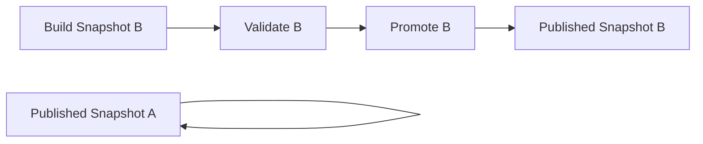

If B fails:

```text
A remains online.
```

---

# 70. Incremental Publishing

A future optimization.

Given:

```text
Revision 120
Revision 121
```

Vault change event says:

```text
engineering/raft.md modified
```

Affected publication data:

```text
raft page
search document
outgoing edges
target backlinks
local graph adjacency
potential hover preview
```

Do not regenerate unrelated assets unnecessarily.

However:

> Correctness before incrementality.

V1 may rebuild the small publication metadata set while reusing unchanged content hashes.

---

# 71. Publication Dependency Graph

Changes propagate.

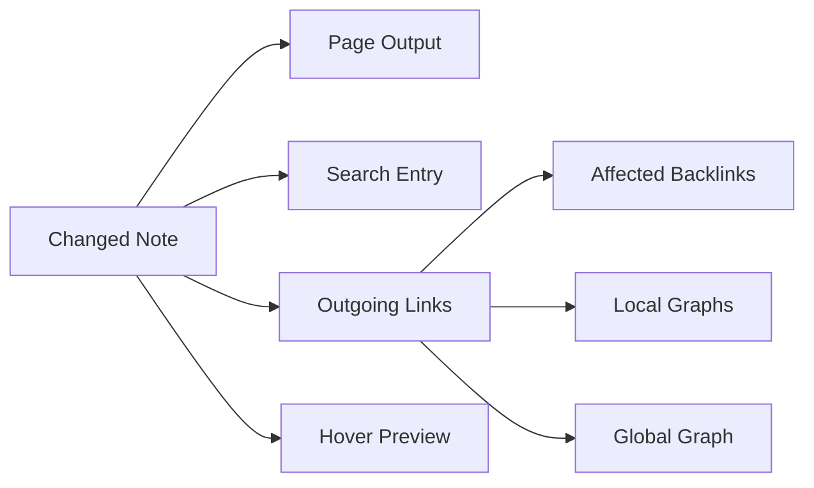

This dependency model should guide incremental publishing later.

---

# 72. Performance Targets

Initial targets:

### Snapshot Generation

For a typical:

```text
1,000 Markdown notes
```

target:

```text
< 2 seconds incremental
< 10 seconds cold snapshot
```

excluding remote deployment.

### Public Site

Target:

```text
article page initial JS        minimal
graph bundle                   lazy
global graph                   lazy
search                         lazy until search interaction
```

Do not ship graph rendering dependencies on every page if local graph is disabled.

---

# 73. Large Graph Strategy

For very large gardens:

```text
10,000+ nodes
```

avoid:

- SVG node-per-element rendering.
- Rendering all labels permanently.
- Running expensive force-layout initialization on every article.

Use:

- Pixi/WebGL.
- Cached layout positions where useful.
- Label culling.
- Progressive rendering.
- Local adjacency for article pages.
- Separate global graph route.

---

# 74. Accessibility

Public publishing must not make graph navigation mandatory.

Every relationship represented in graph must also be available through accessible HTML:

```text
Outgoing links
Backlinks
Related notes
Tags
```

Graph canvas must provide:

- Keyboard escape behavior.
- Reduced motion support.
- Textual fallback.
- Sufficient contrast.
- ARIA labels for controls.

---

# 75. SEO

First-party renderer should generate:

```text
<title>
meta description
canonical URL
Open Graph metadata
Twitter metadata
sitemap.xml
robots.txt
structured article metadata where appropriate
```

The graph itself should not be required for indexing.

---

# 76. RSS

Optional publication config:

```json
{
  "rss": {
    "enabled": true,
    "include": [
      "blog/**"
    ]
  }
}
```

RSS should use publication date metadata where present.

Do not pretend every knowledge-base edit is a blog post.

---

# 77. Analytics

Flux core should not require analytics.

First-party site may provide hooks for:

```text
Plausible
Umami
Cloudflare Web Analytics
custom analytics
```

under explicit configuration.

No Flux telemetry dependency should be required for the public site.

---

# 78. Password Protection

This is provider-dependent.

Model it as deployment capability rather than Markdown semantics.

Example:

```text
Flux Renderer
    +
Cloudflare Access

or

Flux Renderer
    +
Vercel Authentication
```

A future Flux-managed host could expose a common abstraction.

Do not implement weak client-side "password protection" around static HTML.

---

# 79. Custom Domains

Custom domain belongs to Deployment Provider configuration.

```text
publication
    |
    v
deployment
    |
    +-- domain
    +-- DNS status
    +-- TLS status
```

Flux UI may orchestrate the provider API but should not entangle domains with the renderer.

---

# 80. Provider Status Model

```ts
interface DeploymentStatus {
  state:
    | "queued"
    | "building"
    | "ready"
    | "failed";

  url?: string;

  deploymentId?: string;

  message?: string;

  startedAt?: string;
  finishedAt?: string;
}
```

---

# 81. Publication History

Keep bounded metadata:

```text
Published revisions

1032    Aug 08 09:30    active
1021    Aug 07 20:41    previous
1018    Aug 07 18:22    previous
```

Do not duplicate entire deployment artifacts indefinitely in `.flux`.

Remote providers already retain their own deployment history.

Keep local metadata and a small snapshot cache.

---

# 82. Rollback

If provider supports immutable deployments:

```text
rollback -> promote previous deployment
```

For Git-backed publishing:

```text
rollback -> publish previous generated commit
```

Do not modify canonical Markdown during rollback.

---

# 83. Graph/Backlink Correctness Invariants

For public snapshot:

```text
Every GraphNode.pageId exists in publication.pages.

Every GraphEdge.source exists in GraphNode.

Every GraphEdge.target exists in GraphNode.

Every backlink source exists in publication.pages.

Every backlink target exists in publication.pages.

Every resolved public link points to a publication slug.

No private path appears in public metadata.
```

Validate these before renderer invocation.

---

# 84. Manifest Validation

Create a validator in:

```text
packages/publish-contract
```

and Go equivalent/server validation.

Before deployment:

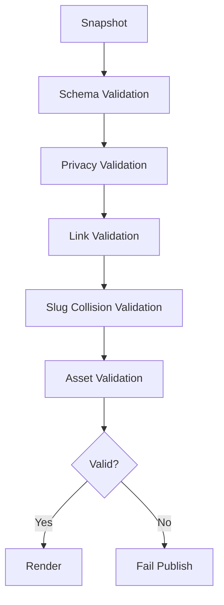

---

# 85. Frontmatter

The current index records tags/property keys but does not yet provide arbitrary frontmatter
values as a publication-ready metadata model.

Therefore publication generation needs frontmatter parsing.

V1:

```text
Read selected Markdown
    |
    v
Parse frontmatter during snapshot
```

Future optimization:

```text
index parsed frontmatter values
```

Do not block Flux Publish v1 on a full index schema redesign.

---

# 86. Supported Frontmatter

Initial common keys:

```yaml
---
title:
description:
publish:
slug:
permalink:
aliases:
tags:
image:
date:
updated:
draft:
---
```

Unknown keys should remain available as generic metadata where safe.

---

# 87. Draft Semantics

Publication should distinguish:

```text
private
draft
public
```

Suggested:

```yaml
publish: true
draft: true
```

means:

```text
included in preview
not included in production deployment
```

unless user explicitly enables draft publishing.

---

# 88. Publication Snapshot Generation Sequence

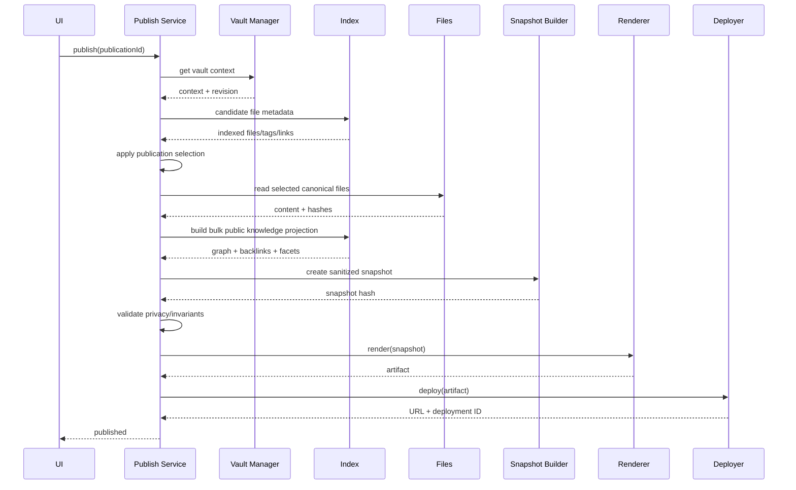

---

# 89. First Publish Sequence

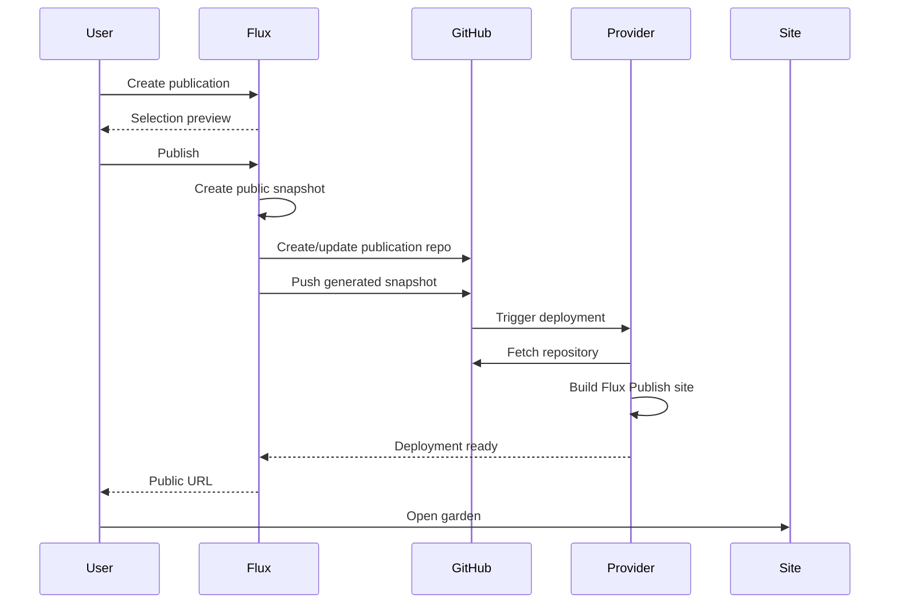

---

# 90. Republish Sequence

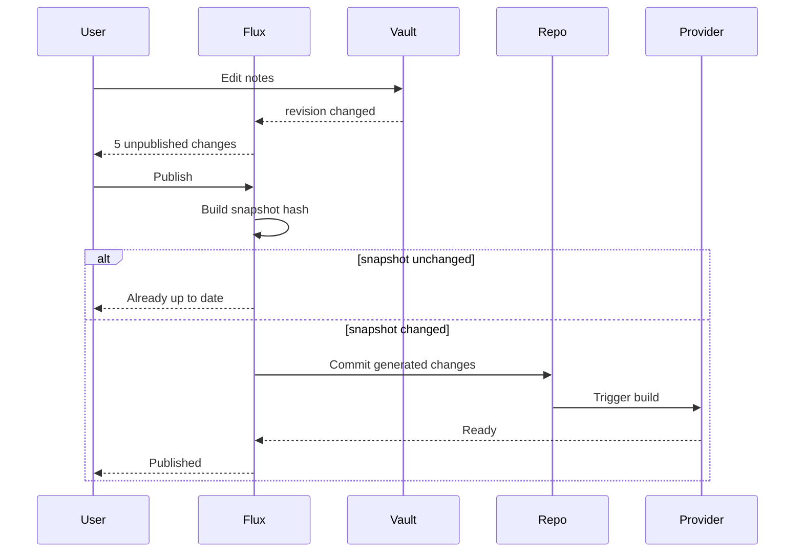

---

# 91. Renderer-Agnostic Data Flow

```mermaid
flowchart TB
    Vault["Vault Files"]
    Index["index.db"]

    Selection["Publish Selection"]
    Semantics["Flux Semantic Resolver"]
    Snapshot["Publication Snapshot v1"]

    subgraph Adapters
        Flux["Flux/Fumadocs"]
        Quartz["Quartz"]
        Flower["Flowershow"]
        Custom["Custom"]
    end

    Vault --> Selection
    Index --> Semantics

    Selection --> Semantics
    Vault --> Semantics

    Semantics --> Snapshot

    Snapshot --> Flux
    Snapshot --> Quartz
    Snapshot --> Flower
    Snapshot --> Custom
```

---

# 92. Plugin Architecture Interaction

Publishing itself should initially be first-party core functionality.

Do not implement Flux Publish as an ordinary plugin.

Reasons:

- Publication handles credentials.
- Publication interacts with Git.
- Publication may configure deployment providers.
- Publication requires a strong privacy boundary.
- Publication requires stable lifecycle semantics.
- Publication spans desktop and server modes.

Later plugins may contribute:

```text
publish renderer
publish transform
publish theme
publish deployment provider
```

through explicit future contribution contracts.

They must not receive unrestricted vault access merely because they implement publishing.

---

# 93. Future Plugin Contribution

Potential manifest:

```json
{
  "contributes": {
    "publishRenderers": [
      {
        "id": "my-renderer",
        "title": "My Renderer"
      }
    ]
  }
}
```

The plugin receives:

```text
sanitized Publication Snapshot
```

not:

```text
raw vault filesystem
```

unless separately granted.

---

# 94. MCP Interaction

MCP agents may eventually invoke:

```text
flux_list_publications
flux_preview_publication
```

Publishing to the internet is a higher-risk side effect.

Actual deployment should require:

```text
explicit publish capability
+
appropriate approval policy
```

Do not grant internet publication under generic:

```text
vault.write
```

Add a separate capability eventually:

```text
publish.deploy
```

---

# 95. Security Model

```mermaid
flowchart LR
    Private["Private Vault"]
    Core["Flux Trusted Publish Core"]
    Snapshot["Public Snapshot"]
    Renderer["Renderer"]
    Internet["Internet"]

    Private --> Core
    Core --> Snapshot
    Snapshot --> Renderer
    Renderer --> Internet

    Secrets["Credential Store"]
    Secrets --> Core

    Secrets -. never .-> Snapshot
    Secrets -. never .-> Renderer
```

Trust boundaries:

### Trusted

```text
Flux backend
Vault manager
Selection engine
Snapshot builder
Credential manager
```

### Untrusted / Less Trusted

```text
Custom renderer
Remote deployment provider
Public browser
Custom site code
External plugin
```

Only already-public material crosses into the renderer boundary.

---

# 96. Threat Model

## Private Note Leakage

Mitigation:

```text
snapshot allowlist
```

not runtime denylist.

---

## Path Traversal

All selected source paths remain vault-relative and validated.

Renderer output paths are independently validated.

---

## Malicious Markdown HTML

First-party renderer sanitizes HTML.

Scripts/event handlers are removed.

---

## Secret Leakage

Secrets never enter:

```text
snapshot
logs
Git commit
manifest
public repository
```

---

## Symlink Escape

Publication file resolution must use the same vault-root security model as file operations.

---

## Generated Site Supply Chain

Pin template/package versions in generated first-party site.

Do not execute arbitrary vault-provided build commands.

---

## Custom CSS

Custom CSS is an explicit advanced setting, disabled by default. It may style only the
already-public site and must not enable script execution. The first-party renderer must
ship a restrictive Content Security Policy: no arbitrary script sources, connections, or
frames; remote font and image origins require an explicit allowlist. Reject `@import` and
external `url(...)` values unless their origins are allowlisted.

---

# 97. Logging

Publish logs:

```text
[10:02:13] snapshot started
[10:02:13] selected 142 notes
[10:02:13] included 23 assets
[10:02:13] resolved 361 graph edges
[10:02:14] snapshot sha256:...
[10:02:14] rendering flux
[10:02:16] pushing publication repository
[10:02:20] deployment queued
[10:02:43] deployment ready
```

Redact:

```text
tokens
Authorization headers
repository credentials
provider credentials
signed URLs
```

---

# 98. User-Facing Diagnostics

Publish validation errors should reference source notes.

Example:

```text
Publication failed

Slug collision:

  /raft

defined by:

  engineering/raft.md
  research/raft.md
```

Example:

```text
Publication warning

engineering/consensus.md embeds:

  ![[private/interview-notes]]

The target is not public and will be replaced by a placeholder.
```

---

# 99. Testing Strategy

## Unit Tests

```text
selection rules
path filtering
frontmatter publish flags
slug generation
slug collision
graph filtering
backlink filtering
private link handling
embed handling
manifest hashing
manifest schema
renderer capability validation
```

---

## Privacy Regression Tests

Most important suite.

Create vault:

```text
public.md
private.md
secret/credentials.md
```

Assert generated output contains none of:

```text
private.md
secret/credentials.md
their contents
their titles
their backlink metadata
their graph nodes
```

except text explicitly typed inside a public note itself.

---

## Golden Snapshot Tests

Input vault fixture:

```text
fixtures/publish/basic-vault
```

Expected:

```text
fixtures/publish/basic-vault.expected/
```

Compare generated manifest and graph deterministically.

---

## Renderer Contract Tests

Every renderer receives the same snapshot fixture.

Verify:

```text
Flux renderer
Quartz adapter
Flowershow adapter
```

all preserve public link targets.

---

## Integration Tests

```text
create publication
preview
publish
modify note
republish
delete note
republish
unpublish
```

---

## Deployment Provider Tests

Mock:

```text
GitHub
Vercel
Cloudflare
Netlify
```

Do not hit real external APIs in ordinary test runs.

---

# 100. Repository-Specific Implementation Plan

## Phase 0 — Contract and Privacy Fixtures

No publishing UI and no broad frontend refactor yet.

Define the smallest versioned publication contract and privacy fixture vault. Lock down:

- Selection precedence.
- Path and symlink validation.
- Public manifest schema.
- Deterministic hashing.
- Private-link, graph, backlink, and search leakage tests.

Do not extract the Markdown engine or graph canvas before the snapshot boundary proves
which reusable seams are actually required.

---

# 101. Phase 1 — Publication Snapshot Core

Add:

```text
packages/publish-contract/
```

Add:

```text
server/internal/publish/
```

Add:

```text
server/internal/index/publication.go
```

Implement:

- Publication config.
- Selection.
- Snapshot generation.
- Graph filtering.
- Bulk backlinks.
- Manifest.
- Validation.
- Content hashing.
- Local filesystem export.

No Fumadocs deployment required yet.

Acceptance:

```text
flux publish export
```

can produce a safe renderer-neutral bundle.

---

# 102. Phase 2 — Flux Publish Renderer

Add:

```text
apps/publish
packages/publish-ui
```

Before implementing renderer features, extract only the Markdown behavior and graph
primitives the renderer actually consumes. Keep the existing product wrappers in
`app-core`; avoid parallel parsers or graph semantics.

Implement:

- Fumadocs source adapter.
- Flux layout.
- Article rendering.
- File explorer.
- TOC.
- Backlinks.
- Local graph.
- Global graph.
- Search.
- Hover previews.
- Tags.
- Static metadata.
- Themes.

Acceptance:

```text
Publication Snapshot
    ->
apps/publish
    ->
fully navigable static knowledge garden
```

---

# 103. Phase 3 — Flux Product UI

Update:

```text
packages/app-core
packages/bridge-contract
packages/client-web
packages/client-desktop
apps/desktop
server/internal/api
```

Implement:

- Publication settings.
- Selection UI.
- Preview.
- Publish jobs.
- Publish status.
- Public URL.
- Warnings.

---

# 104. Phase 4 — GitHub Deployment

Implement:

```text
Git repository creation/adoption
generated-content commits
push
GitHub Pages configuration
deployment status
```

Recommended first remote target because it aligns naturally with Flux VCS and OSS users.

---

# 105. Phase 5 — Vercel / Cloudflare

Add deployment providers.

Keep renderer unchanged.

```text
Flux Renderer
      |
      +-- GitHub Pages
      +-- Vercel
      +-- Cloudflare
```

---

# 106. Phase 6 — Quartz Adapter

Implement translation from:

```text
Publication Snapshot
```

to:

```text
Quartz-compatible repository
```

Do not let Quartz recalculate public/private selection from the entire vault.

---

# 107. Phase 7 — Flowershow Adapter

Same model.

---

# 108. Proposed Repository Diff

```text
project-flux/
├── apps/
│   ├── desktop/
│   ├── web/
│   └── publish/
│       ├── app/
│       ├── components/
│       ├── lib/
│       ├── package.json
│       └── next.config.ts
│
├── packages/
│   ├── app-core/
│   ├── bridge-contract/
│   ├── client-desktop/
│   ├── client-web/
│   ├── shared-domain/
│   ├── shared-ui/
│   │
│   ├── markdown-engine/
│   │   ├── package.json
│   │   └── src/
│   │
│   ├── graph-ui/
│   │   ├── package.json
│   │   └── src/
│   │
│   ├── publish-contract/
│   │   ├── package.json
│   │   └── src/
│   │
│   └── publish-ui/
│       ├── package.json
│       └── src/
│
└── server/
    └── internal/
        ├── api/
        │   └── publish_routes.go
        │
        ├── domain/
        │   └── publish_types.go
        │
        ├── index/
        │   └── publication.go
        │
        └── publish/
            ├── service.go
            ├── config.go
            ├── selection.go
            ├── snapshot.go
            ├── manifest.go
            ├── validation.go
            ├── jobs.go
            ├── renderer.go
            ├── deployment.go
            ├── secrets.go
            │
            ├── renderers/
            │   ├── flux.go
            │   ├── quartz.go
            │   ├── flowershow.go
            │   └── static.go
            │
            └── providers/
                ├── filesystem.go
                ├── github.go
                ├── vercel.go
                ├── cloudflare.go
                └── netlify.go
```

---

# 109. Files That Should Be Modified First

Based on the current architecture:

```text
packages/bridge-contract/src/index.ts
```

Add publish control-plane contracts.

```text
packages/client-web/src/index.ts
```

Implement HTTP methods.

```text
packages/client-desktop/
apps/desktop/src/preload/
apps/desktop/src/main/
```

Expose corresponding desktop transport.

```text
server/internal/index/store.go
server/internal/index/insights.go
```

Do not heavily expand these files.

Instead extract publication-specific bulk behavior to:

```text
server/internal/index/publication.go
```

```text
server/internal/api/routes.go
```

Register publication routes but keep implementation in:

```text
publish_routes.go
```

---

# 110. Code That Should NOT Be Reimplemented

Reuse or extract functionality from:

```text
server/internal/index/
    link extraction
    link resolution
    graph generation
    tags
    references
    FTS semantics
```

Reuse/refactor:

```text
packages/app-core/src/reading-view.tsx
    Markdown behavior

packages/app-core/src/graph-view.tsx
    graph rendering primitives
```

Do not maintain:

```text
Desktop markdown parser
+
Publish markdown parser
+
Quartz-specific link resolver
```

That will drift.

---

# 111. HLD Changes Required

Existing main Flux HLD should be updated.

Remove:

```text
Reimplementation of Quartz publishing.
```

from the out-of-scope wording if it implies Flux has no first-party publisher.

Replace Quartz section with:

```text
Publishing Architecture
```

and document:

```text
Flux Publish Core
Publication Snapshot
First-party Flux Renderer
Quartz Adapter
Flowershow Adapter
Deployment Providers
```

Quartz should become a subsection instead of the publishing architecture itself.

---

# 112. Product Positioning

Flux should not market this as:

> Supports Fumadocs.

Users generally do not care.

Product message:

> Publish your vault anywhere.

Default:

```text
Publish
    ->
Flux Garden
    ->
Done
```

Advanced:

```text
Publish
    |
    +-- Flux
    +-- Quartz
    +-- Flowershow
    +-- Custom
```

---

# 113. Architectural Positioning

The important abstraction is:

```text
                     Markdown Vault
                           |
                           v
                 Flux Knowledge Model
                           |
             +-------------+-------------+
             |             |             |
             v             v             v
           Search        Graph       Backlinks
             |             |             |
             +-------------+-------------+
                           |
                           v
                 Publication Snapshot
                           |
         +-----------------+-------------------+
         |                 |                   |
         v                 v                   v
     Flux Garden         Quartz           Flowershow
         |
         v
  User-controlled host
```

The knowledge model stays portable.

The renderer stays replaceable.

The host stays replaceable.

The Markdown stays canonical.

---

# 114. Competitive Differentiation

Obsidian's typical model:

```text
Vault
  |
  v
Obsidian Publish
```

Flux model:

```text
Vault
  |
  v
Flux Publish Core
  |
  +-- Flux Garden
  +-- Quartz
  +-- Flowershow
  +-- Static
  +-- Custom
       |
       v
    Any host
```

This gives Flux a strong OSS property:

> Publication is a capability, not a hosted-product lock-in.

---

# 115. Release Checklists

## V1A — Safe Publication Core

Ship and validate this boundary before building remote deployment:

- [ ] Deterministic selective publication.
- [ ] Markdown, wiki links, Markdown links, and internal embeds.
- [ ] Referenced images/assets.
- [ ] Privacy validation and unpublished-link handling.
- [ ] Public-only graph and backlink artifacts.
- [ ] Renderer-neutral manifest.
- [ ] Local static export.
- [ ] Local publication preview.
- [ ] Idempotent rebuilds.
- [ ] Privacy regression suite.

## V1B — First-Party Publish Experience

Add only after V1A is stable:

- [ ] Flux/Fumadocs renderer.
- [ ] Explorer navigation and TOC.
- [ ] Backlinks and backlink context.
- [ ] Search.
- [ ] Tags.
- [ ] Code highlighting and callouts.
- [ ] Light, dark, and system themes.
- [ ] Mobile layout.
- [ ] Git-backed publishing and one remote target: GitHub Pages.
- [ ] Public URL and deployment status.

## Parity Backlog

Useful, but not release blockers for the first trustworthy publisher:

- [ ] Mermaid.
- [ ] Math/KaTeX.
- [ ] Local graph UI.
- [ ] Global graph UI.
- [ ] Hover previews.
- [ ] Custom logo and favicon.
- [ ] Custom CSS with an explicit CSP and trust model.
- [ ] SEO metadata and sitemap.
- [ ] Additional deployment providers.

---

# 116. V1.1 / V2 Features

Later:

- [ ] Automatic redirects after note moves.
- [ ] Password-protected sites.
- [ ] Managed Flux hosting.
- [ ] Semantic search.
- [ ] Analytics UI.
- [ ] Comment system.
- [ ] RSS configuration.
- [ ] Renderer plugins.
- [ ] Deployment-provider plugins.
- [ ] Multiple language publication.
- [ ] Publication branches.
- [ ] Scheduled publication.
- [ ] Draft deployments.
- [ ] Incremental graph artifacts.
- [ ] Publish-from-MCP with explicit approval.
- [ ] Multi-user publishing roles.

---

# 117. Acceptance Criteria

Flux Publish architecture is considered correctly implemented when:

1. A private note cannot appear in generated publication artifacts accidentally.
2. Graphs contain only public nodes.
3. Backlinks contain only public source documents.
4. Search indexes contain only public content.
5. Fumadocs never needs unrestricted access to the source vault.
6. Quartz and Flux Renderer can consume the same semantic snapshot.
7. Publishing does not mutate Markdown unless explicitly requested.
8. Publishing does not block normal editing.
9. Failed deployments do not destroy the currently published deployment.
10. Re-running publish on unchanged content creates no unnecessary commit.
11. Desktop and web use the same `FluxClient` publishing contract.
12. Renderer choice is independent from hosting provider choice.
13. Provider credentials never enter the vault or publication repository.
14. Public-site graph behavior derives from the Flux knowledge model.
15. First-party site can be heavily customized without forking Flux itself.

---

# 118. Final Architecture

```mermaid
flowchart TB
    User["Flux User"]

    subgraph FluxApp["Flux"]
        UI["app-core Publish UI"]

        Bridge["FluxClient"]

        subgraph Go["Go Modular Monolith"]
            Vault["Vault Manager"]
            Index["Index / Graph / References"]
            Publish["Publish Core"]
            Select["Selection Engine"]
            Snapshot["Snapshot Builder"]
            Jobs["Publish Jobs"]
            Secrets["Credential References"]
        end
    end

    Files["Canonical Markdown + Assets"]

    subgraph PublicIR["Sanitized Publication Boundary"]
        Manifest["manifest.json"]
        Graph["graph.json"]
        Backlinks["backlinks.json"]
        Content["Public Content"]
        Assets["Public Assets"]
    end

    subgraph Renderers["Renderer Layer"]
        FluxRenderer["Flux / Fumadocs"]
        Quartz["Quartz"]
        Flowershow["Flowershow"]
        Custom["Custom"]
    end

    subgraph Deployment["Deployment Layer"]
        GitHub["GitHub Pages"]
        Vercel["Vercel"]
        Cloudflare["Cloudflare"]
        Netlify["Netlify"]
        Export["Static Export"]
    end

    User --> UI
    UI --> Bridge
    Bridge --> Publish

    Vault --> Files
    Vault --> Index

    Files --> Select
    Index --> Select

    Select --> Snapshot
    Snapshot --> Manifest
    Snapshot --> Graph
    Snapshot --> Backlinks
    Snapshot --> Content
    Snapshot --> Assets

    Manifest --> FluxRenderer
    Graph --> FluxRenderer
    Backlinks --> FluxRenderer
    Content --> FluxRenderer
    Assets --> FluxRenderer

    PublicIR --> Quartz
    PublicIR --> Flowershow
    PublicIR --> Custom

    FluxRenderer --> GitHub
    FluxRenderer --> Vercel
    FluxRenderer --> Cloudflare
    FluxRenderer --> Netlify
    FluxRenderer --> Export

    Quartz --> GitHub
    Quartz --> Vercel
    Quartz --> Cloudflare

    Flowershow --> Vercel

    Secrets --> Deployment
```

---

# 119. Final Recommendation

Implement Flux Publish in this order:

```text
1. Publication Contract
2. Safe Snapshot Builder
3. Bulk Graph/Backlink Projection
4. Markdown Engine Extraction
5. Graph UI Extraction
6. First-party Flux/Fumadocs Renderer
7. Flux Publish Preview
8. Git-backed Deployment
9. GitHub Pages
10. Vercel / Cloudflare
11. Quartz Adapter
12. Flowershow Adapter
13. External Renderer SDK
```

Do not begin by integrating Quartz.

Do not begin by building deployment provider APIs.

Do not begin by pointing Fumadocs at the vault repository.

The most important piece is:

```text
             Publication Snapshot
```

because that becomes the stable security and semantic boundary around which every other
publishing feature is built.

Once that abstraction exists:

```text
Flux
Quartz
Flowershow
Fumadocs
Custom sites
future renderers
```

all become replaceable consumers instead of separate implementations of the Flux
knowledge model.

That is the architecture that gives Flux an actual long-term advantage instead of merely
adding another "Publish" button.
